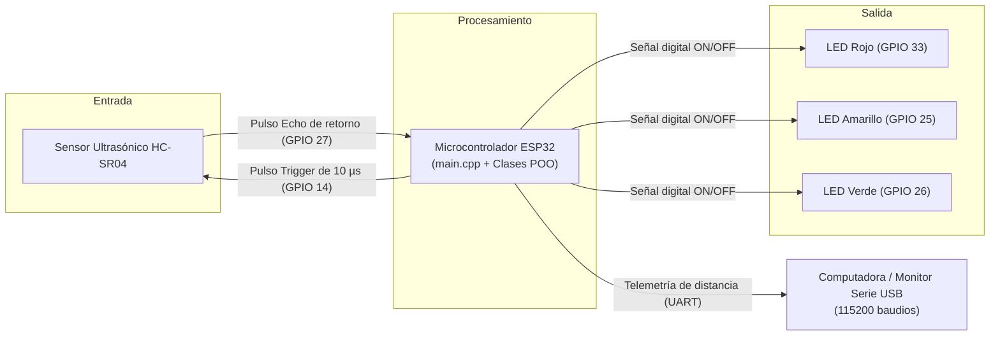
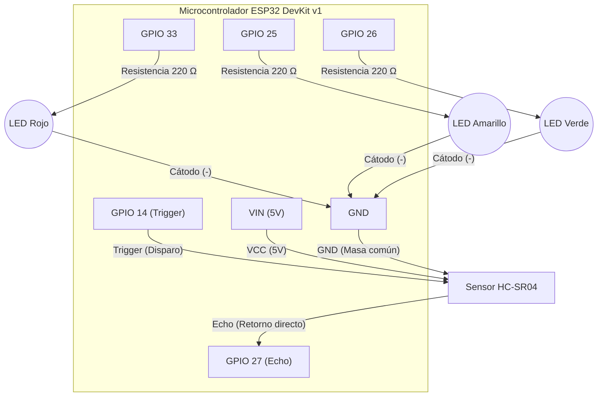
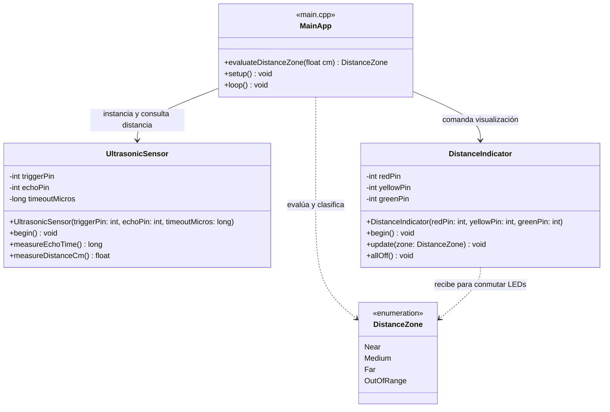
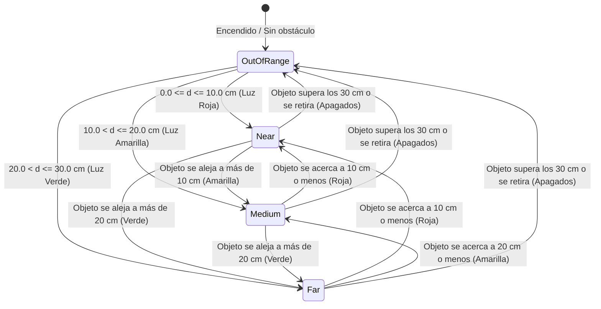
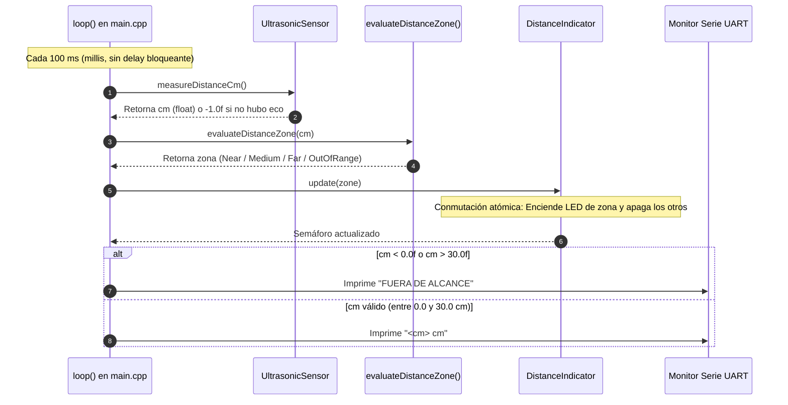

# Práctica 1 — Integración de Sensores y Actuadores en un Objeto Inteligente
## Informe Técnico de Ingeniería y Desarrollo

---

**Asignatura:** Internet de las Cosas  
**Institución:** Universidad Católica Boliviana "San Pablo" (UCB)  
**Proyecto:** Objeto Inteligente de Medición de Distancia y Semáforo LED   
**Microcontrolador:** DOIT ESP32 DevKit v1   
**Entorno de Desarrollo:** PlatformIO en Visual Studio Code (Framework Arduino en C++)  
**Integrantes del Grupo:**
- María Jesús Lozada Peralta
- Samuel Jarro Rodriguez
- Katherine Montaño Mejia

---

## 1. Requerimientos Funcionales y No Funcionales

### 1.1 ¿Qué es este Objeto Inteligente y cómo funciona?
Este proyecto consiste en un **objeto inteligente** capaz de medir a qué distancia se encuentra un obstáculo en tiempo real y alertar de forma visual mediante un semáforo de tres luces LED (**Rojo**, **Amarillo** y **Verde**).

El sistema está compuesto por tres partes fundamentales:
1. **Sensor ultrasónico (HC-SR04):** Emite un pulso de sonido inaudible (40 kHz) y mide cuánto tiempo tarda el eco en rebotar y regresar (**Tiempo de Vuelo** o *Time-of-Flight*).
2. **Microcontrolador (ESP32):** Procesa el tiempo medido, calcula la distancia en centímetros ($d = t \times 0.01723$), clasifica la proximidad en rangos y comanda los actuadores.
3. **Actuadores (3 LEDs):** Indican visualmente el nivel de cercanía bajo una regla estricta de **exclusión mutua** (solo un LED encendido a la vez; nunca dos o tres juntos).

Adicionalmente, el ESP32 transmite continuamente las lecturas por el cable USB a la computadora a 115200 baudios, permitiendo monitorear el sistema en tiempo real.

---

### 1.2 Requerimientos Funcionales (RF)

| ID | Nombre | Descripción corta o criterio de cumplimiento |
| :---: | :--- | :--- |
| **RF1** | Medición de Distancia | El sensor HC-SR04 emite un pulso acústico de $10\,\mu\text{s}$ y mide el eco con `pulseIn()`, calculando la distancia en centímetros. Si no hay eco en 30 ms, devuelve `-1.0f`. |
| **RF2** | Clasificación en Rangos | La función `evaluateDistanceZone()` clasifica la distancia en 4 rangos continuos y sin solapamiento (Near, Medium, Far y OutOfRange). |
| **RF3** | Control Exclusivo de LEDs | La clase `DistanceIndicator` enciende un único LED según la zona detectada (**exclusión mutua**), o apaga los tres si el objeto está fuera de rango o no hay eco. |
| **RF4** | Telemetría Serie UART | El programa transmite continuamente por el cable USB la distancia en centímetros (`"<d> cm"`) o el mensaje `"FUERA DE ALCANCE"` a 115200 baudios. |
| **RF5** | Modo de Diagnóstico (Debug) | Con la variable booleana `debugActivo = true` en `main.cpp`, el sistema imprime diagnósticos explicativos en lenguaje claro para facilitar pruebas en laboratorio. |

---

### 1.3 Rangos definidos por el grupo

Los rangos de proximidad son continuos y mutuamente excluyentes (sin huecos ni solapamientos):

| Distancia medida ($d$) | Rango (`DistanceZone`) | Comportamiento del actuador | Señalización Visual |
| :---: | :---: | :--- | :---: |
| $0.0\text{ cm} \le d \le 10.0\text{ cm}$ | `Near` (Cerca) | LED Rojo encendido (Amarillo y Verde apagados) | 🔴 Proximidad crítica |
| $10.0\text{ cm} < d \le 20.0\text{ cm}$ | `Medium` (Medio) | LED Amarillo encendido (Rojo y Verde apagados) | 🟡 Advertencia |
| $20.0\text{ cm} < d \le 30.0\text{ cm}$ | `Far` (Lejos) | LED Verde encendido (Rojo y Amarillo apagados) | 🟢 Zona segura |
| $d > 30.0\text{ cm}$ o sin eco ($d < 0.0\text{ cm}$) | `OutOfRange` | Los 3 LEDs apagados | ⚫ Fuera de alcance |

---

### 1.4 Requerimientos No Funcionales (RNF)

| ID | Nombre | Descripción corta o criterio de cumplimiento |
| :---: | :--- | :--- |
| **RNF1** | Estabilidad operativa | Operación continua $\ge 10\text{ minutos}$ sin reinicios ni bloqueos. Al usar temporización no bloqueante con `millis()` (`intervaloLecturaMs = 100`) y timeout de $30\text{ ms}$ en `pulseIn()`, no existen bloqueos del watchdog del ESP32. Memoria estática fija sin fugas. |
| **RNF2** | Exactitud de medición | Error máximo $\le \pm 3.0\text{ cm}$ frente a una cinta métrica en el rango de trabajo ($2\text{ a }30\text{ cm}$), calibrado con la constante cinemática $0.01723\,\text{cm}/\mu\text{s}$. (Por debajo de 2 cm el sensor entra en su zona ciega física). |
| **RNF3** | Tiempo de respuesta | $\le 150\text{ ms}$ desde el movimiento del obstáculo hasta la actualización del LED correspondiente (muy por debajo del límite de consigna $\le 1.0\text{ s}$). |
| **RNF4** | Frecuencia de muestreo | $\ge 2\text{ lecturas/segundo}$ (el diseño opera a $\approx 10\text{ lecturas/s}$ al ejecutarse cada $100\text{ ms}$ con `millis()`). |


---

## 2. Análisis y Diseño

### 2.1 Diagrama de arquitectura del sistema



**Explicación del diagrama:** Muestra el flujo de información del sistema dividido en tres etapas: la **Entrada** adquiere los datos físicos mediante el sensor HC-SR04; el **Procesamiento** (ESP32) calcula la distancia en centímetros y toma la decisión de qué zona activar; y la **Salida** presenta el resultado mediante el semáforo de 3 LEDs y el envío de texto por el cable USB a la computadora.

---

### 2.2 Diagrama de circuito real

El circuito físico armado en protoboard conecta el sensor ultrasónico directamente al microcontrolador y utiliza resistencias limitadoras de $220\,\Omega$ **únicamente en los tres LEDs** para protegerlos de sobrecorriente:



**Explicación del diagrama:** Representa el montaje físico real en protoboard. El sensor HC-SR04 se alimenta con los 5V del pin `VIN` y se conecta directamente a los pines `GPIO 14` (Trigger) y `GPIO 27` (Echo). Cada uno de los tres LEDs cuenta con su respectiva resistencia limitadora de $220\,\Omega$ en serie hacia el ánodo, cerrando sus cátodos a la línea común de tierra (`GND`).

> **Nota técnica de ingeniería:** En nuestro montaje de laboratorio el pin Echo se conectó directo al GPIO 27 para simplificar el prototipo. Para una versión industrial o permanente se recomienda añadir un divisor de voltaje (ej. 1 kΩ y 2 kΩ) en la línea Echo para adaptar los 5 V del sensor a los 3.3 V tolerados por el ESP32.

---

### 2.3 Diagrama estructural (Clases)



**Explicación del diagrama:** Modela la estructura orientada a objetos del código fuente. Muestra cómo la clase `UltrasonicSensor` encapsula el hardware del sensor, la clase `DistanceIndicator` controla los LEDs con exclusión mutua, la enumeración `DistanceZone` define los estados válidos del semáforo, y la función `evaluateDistanceZone` clasifica la distancia de manera pura e independiente del hardware.

---

### 2.4 Diagramas de comportamiento

#### A. Máquina de Estados de Proximidad


**Explicación del diagrama:** Ilustra cómo reacciona el semáforo ante el movimiento continuo de un obstáculo, transitando entre zonas de forma determinista y apagando todos los LEDs al alejarse más allá de 30 cm.

#### B. Secuencia de un Ciclo de Muestreo (Secuencia Temporal)


**Explicación del diagrama:** Detalla la secuencia paso a paso de lo que ocurre dentro del lazo continuo del ESP32 cada 100 milisegundos: se adquiere la distancia, se clasifica en una zona lógica, se actualiza el semáforo LED de forma atómica y se emite la telemetría correspondiente a la computadora.

---

## 3. Desarrollo e Implementación

### 3.1 Decisiones de diseño

- **Responsabilidad Única (POO):** Se separó el hardware en dos clases autónomas: `UltrasonicSensor` (lectura física del tiempo de vuelo) y `DistanceIndicator` (control seguro de los LEDs).
- **Temporización no bloqueante con `millis()`:** Se eliminó el `delay(100)` bloqueante del `loop()` y se sustituyó por una comprobación de intervalo (`ahora - ultimaLecturaMs >= intervaloLecturaMs`), permitiendo que el microcontrolador no se congele durante la ejecución.
- **Tipado fuertemente tipado (`enum class`):** Se utilizó `enum class DistanceZone` para evitar números mágicos (0, 1, 2) y hacer que el código sea autoexplicativo durante la defensa oral.
- **Desacoplamiento para pruebas en PC:** La función `evaluateDistanceZone` no incluye librerías de Arduino; es una función pura de C++ que se puede compilar y verificar en computadoras con Unity sin necesidad de conectar la placa.
- **Convención y buenas prácticas:** Identificadores limpios en `camelCase`, cero guiones bajos (`_`), directiva `#pragma once` en cabeceras y tipos primitivos de C++ (`int`, `float`, `long`, `unsigned long`, `bool`).

---

### 3.2 Código fuente documentado

A continuación se presenta el código fuente completo del proyecto, estructurado modularmente con programación orientada a objetos (POO) y documentado exhaustivamente mediante estándares Doxygen y comentarios explicativos en lenguaje claro:

#### A. Módulo de Lógica Pura: [`include/DistanceZone.h`](file:///c:/Users/Maria/OneDrive/Documentos/PlatformIO/Projects/UltrasonicLedsSensor/include/DistanceZone.h) y [`src/DistanceZone.cpp`](file:///c:/Users/Maria/OneDrive/Documentos/PlatformIO/Projects/UltrasonicLedsSensor/src/DistanceZone.cpp)

```cpp
// =====================================================================
// ARCHIVO: include/DistanceZone.h
// =====================================================================
#pragma once

/**
 * @file DistanceZone.h
 * @brief Definición de las zonas de proximidad y función de evaluación.
 * 
 * Proyecto: Objeto Inteligente de Medición de Distancia y Semáforo LED
 * Microcontrolador: DOIT ESP32 DevKit v1
 */

// Representa las cuatro zonas de proximidad posibles del sistema
enum class DistanceZone {
    Near,        // Distancia menor o igual a 10.0 cm (LED Rojo)
    Medium,      // Distancia entre 10.0 y 20.0 cm (LED Amarillo)
    Far,         // Distancia entre 20.0 y 30.0 cm (LED Verde)
    OutOfRange   // Distancia mayor a 30.0 cm o sin eco/negativa (Todos los LEDs apagados)
};

/**
 * @brief Evalúa y clasifica una distancia en centímetros dentro de una zona de proximidad.
 * @param cm Distancia medida en centímetros (o valor negativo si ocurrió error/timeout).
 * @return DistanceZone Zona correspondiente (Near, Medium, Far, OutOfRange).
 */
DistanceZone evaluateDistanceZone(float cm);
```

```cpp
// =====================================================================
// ARCHIVO: src/DistanceZone.cpp
// =====================================================================
/**
 * @file DistanceZone.cpp
 * @brief Implementación de la clasificación de distancia en rangos discretos.
 * 
 * Proyecto: Objeto Inteligente de Medición de Distancia y Semáforo LED
 */

#include "DistanceZone.h"

// Clasifica la distancia en centímetros según los rangos del sistema original
DistanceZone evaluateDistanceZone(float cm) {
    if (cm < 0.0f) {
        return DistanceZone::OutOfRange; // Lectura errónea o sin eco (timeout -1.0f)
    } else if (cm <= 10.0f) {
        return DistanceZone::Near;       // 0.0 a 10.0 cm (Proximidad crítica -> LED Rojo)
    } else if (cm <= 20.0f) {
        return DistanceZone::Medium;     // 10.1 a 20.0 cm (Advertencia -> LED Amarillo)
    } else if (cm <= 30.0f) {
        return DistanceZone::Far;        // 20.1 a 30.0 cm (Zona segura -> LED Verde)
    } else {
        return DistanceZone::OutOfRange; // Mayor a 30.0 cm (Fuera de alcance -> LEDs apagados)
    }
}
```

#### B. Módulo del Sensor: [`include/UltrasonicSensor.h`](file:///c:/Users/Maria/OneDrive/Documentos/PlatformIO/Projects/UltrasonicLedsSensor/include/UltrasonicSensor.h) y [`src/UltrasonicSensor.cpp`](file:///c:/Users/Maria/OneDrive/Documentos/PlatformIO/Projects/UltrasonicLedsSensor/src/UltrasonicSensor.cpp)

```cpp
// =====================================================================
// ARCHIVO: include/UltrasonicSensor.h
// =====================================================================
#pragma once

/**
 * @file UltrasonicSensor.h
 * @brief Controlador del sensor ultrasónico HC-SR04.
 * 
 * Proyecto: Objeto Inteligente de Medición de Distancia y Semáforo LED
 * Microcontrolador: DOIT ESP32 DevKit v1
 */

#include <Arduino.h>

// Clase para controlar el sensor ultrasónico HC-SR04
class UltrasonicSensor {
public:
    /**
     * @brief Constructor del sensor ultrasónico.
     * @param triggerPin Pin GPIO conectado al Trigger del sensor.
     * @param echoPin Pin GPIO conectado al Echo del sensor.
     * @param timeoutMicros Tiempo límite en microsegundos para pulseIn (por defecto 30000 µs = 30 ms).
     */
    UltrasonicSensor(int triggerPin, int echoPin, long timeoutMicros = 30000);

    /**
     * @brief Configura los modos de los pines (OUTPUT para Trigger, INPUT para Echo).
     */
    void begin();

    /**
     * @brief Emite el pulso de disparo de 10 µs y mide la duración del eco.
     * @return Duración del pulso de eco en microsegundos, o 0 si ocurrió timeout.
     */
    long measureEchoTime();

    /**
     * @brief Mide el eco y calcula la distancia en centímetros usando la velocidad del sonido.
     * @return Distancia en centímetros, o -1.0f si no hubo eco (timeout).
     */
    float measureDistanceCm();

private:
    int triggerPin;
    int echoPin;
    long timeoutMicros;
};
```

```cpp
// =====================================================================
// ARCHIVO: src/UltrasonicSensor.cpp
// =====================================================================
/**
 * @file UltrasonicSensor.cpp
 * @brief Implementación de las funciones de disparo y medición del HC-SR04.
 * 
 * Proyecto: Objeto Inteligente de Medición de Distancia y Semáforo LED
 */

#include "UltrasonicSensor.h"

UltrasonicSensor::UltrasonicSensor(int triggerPin, int echoPin, long timeoutMicros) {
    this->triggerPin = triggerPin;
    this->echoPin = echoPin;
    this->timeoutMicros = timeoutMicros;
}

void UltrasonicSensor::begin() {
    pinMode(triggerPin, OUTPUT);
    pinMode(echoPin, INPUT);
    digitalWrite(triggerPin, LOW);
}

long UltrasonicSensor::measureEchoTime() {
    // 1. Limpiar el pin de disparo
    digitalWrite(triggerPin, LOW);
    delayMicroseconds(2);

    // 2. Enviar pulso de 10 microsegundos para activar el ultrasonido
    digitalWrite(triggerPin, HIGH);
    delayMicroseconds(10);
    digitalWrite(triggerPin, LOW);

    // 3. Medir duración del eco en el pin de recepción con tiempo límite (30 ms)
    return pulseIn(echoPin, HIGH, timeoutMicros);
}

float UltrasonicSensor::measureDistanceCm() {
    long duracion = measureEchoTime();

    if (duracion == 0) {
        return -1.0f; // Si no hay eco (timeout), se retorna -1.0f como código de error
    }

    // Conversión a centímetros usando la velocidad del sonido en el aire (343 m/s / 2 = 0.01723 cm/µs)
    return duracion * 0.01723f;
}
```

#### C. Módulo de Actuadores LED: [`include/DistanceIndicator.h`](file:///c:/Users/Maria/OneDrive/Documentos/PlatformIO/Projects/UltrasonicLedsSensor/include/DistanceIndicator.h) y [`src/DistanceIndicator.cpp`](file:///c:/Users/Maria/OneDrive/Documentos/PlatformIO/Projects/UltrasonicLedsSensor/src/DistanceIndicator.cpp)

```cpp
// =====================================================================
// ARCHIVO: include/DistanceIndicator.h
// =====================================================================
#pragma once

/**
 * @file DistanceIndicator.h
 * @brief Controlador del semáforo visual de 3 LEDs con exclusión mutua.
 * 
 * Proyecto: Objeto Inteligente de Medición de Distancia y Semáforo LED
 * Microcontrolador: DOIT ESP32 DevKit v1
 */

#include <Arduino.h>
#include "DistanceZone.h"

// Clase para controlar el semáforo de tres LEDs
class DistanceIndicator {
public:
    /**
     * @brief Constructor del semáforo de distancia.
     * @param redPin Pin GPIO para el LED Rojo.
     * @param yellowPin Pin GPIO para el LED Amarillo.
     * @param greenPin Pin GPIO para el LED Verde.
     */
    DistanceIndicator(int redPin, int yellowPin, int greenPin);

    /**
     * @brief Inicializa los pines GPIO como salidas digitales (OUTPUT) y los apaga.
     */
    void begin();

    /**
     * @brief Conmuta los LEDs garantizando exclusión mutua según la zona de proximidad.
     * @param zone Zona evaluada (Near -> Rojo, Medium -> Amarillo, Far -> Verde, OutOfRange -> Todos apagados).
     */
    void update(DistanceZone zone);

    /**
     * @brief Apaga simultáneamente los tres LEDs.
     */
    void allOff();

private:
    int redPin;
    int yellowPin;
    int greenPin;
};
```

```cpp
// =====================================================================
// ARCHIVO: src/DistanceIndicator.cpp
// =====================================================================
/**
 * @file DistanceIndicator.cpp
 * @brief Implementación del control de LEDs con regla estricta de exclusión mutua.
 * 
 * Proyecto: Objeto Inteligente de Medición de Distancia y Semáforo LED
 */

#include "DistanceIndicator.h"

DistanceIndicator::DistanceIndicator(int redPin, int yellowPin, int greenPin) {
    this->redPin = redPin;
    this->yellowPin = yellowPin;
    this->greenPin = greenPin;
}

void DistanceIndicator::begin() {
    pinMode(redPin, OUTPUT);
    pinMode(yellowPin, OUTPUT);
    pinMode(greenPin, OUTPUT);
    allOff();
}

void DistanceIndicator::allOff() {
    digitalWrite(redPin, LOW);
    digitalWrite(yellowPin, LOW);
    digitalWrite(greenPin, LOW);
}

void DistanceIndicator::update(DistanceZone zone) {
    switch (zone) {
        case DistanceZone::Near:
            // Cerca (menor o igual a 10 cm): únicamente el LED rojo encendido
            digitalWrite(redPin, HIGH);
            digitalWrite(yellowPin, LOW);
            digitalWrite(greenPin, LOW);
            break;

        case DistanceZone::Medium:
            // Distancia media (entre 10 y 20 cm): únicamente el LED amarillo encendido
            digitalWrite(redPin, LOW);
            digitalWrite(yellowPin, HIGH);
            digitalWrite(greenPin, LOW);
            break;

        case DistanceZone::Far:
            // Lejos (entre 20 y 30 cm): únicamente el LED verde encendido
            digitalWrite(redPin, LOW);
            digitalWrite(yellowPin, LOW);
            digitalWrite(greenPin, HIGH);
            break;

        case DistanceZone::OutOfRange:
        default:
            // Fuera de alcance (mayor a 30 cm o sin eco): todos los LEDs apagados
            allOff();
            break;
    }
}
```

#### D. Programa Principal: [`src/main.cpp`](file:///c:/Users/Maria/OneDrive/Documentos/PlatformIO/Projects/UltrasonicLedsSensor/src/main.cpp)

```cpp
// =====================================================================
// ARCHIVO: src/main.cpp
// =====================================================================
/**
 * @file main.cpp
 * @brief Programa principal del Objeto Inteligente de Medición de Distancia y Semáforo LED.
 * 
 * Asignatura: Internet de las Cosas
 * Institución: Universidad Católica Boliviana "San Pablo" (UCB)
 * Microcontrolador: DOIT ESP32 DevKit v1 (240 MHz)
 * Integrantes:
 *   - María Jesús Lozada Peralta
 *   - Samuel Jarro Rodriguez
 *   - Katherine Montaño Mejia
 */

#include <Arduino.h>
#include "UltrasonicSensor.h"
#include "DistanceIndicator.h"
#include "DistanceZone.h"

// =====================================================================
// Configuración de Salidas de Depuración (Debugging)
// =====================================================================
// Esta variable booleana controla si se muestran mensajes de ayuda
// en el monitor serie para diagnosticar el estado del sensor y los LEDs.
// - true: Muestra mensajes detallados de depuración.
// - false: Muestra únicamente la salida estándar limpia.
const bool debugActivo = false;

// =====================================================================
// Pines del Microcontrolador (Variables en camelCase, sin guiones bajos)
// =====================================================================
const int ledRojo = 33;
const int ledAmarillo = 25;
const int ledVerde = 26;

const int pinTrigger = 14;
const int pinEcho = 27;
const unsigned long intervaloLecturaMs = 100;   // intervalo de tiempo entre lecturas del sensor en milisegundos
unsigned long ultimaLecturaMs = 0;              // guarda el momento de la última lectura

// =====================================================================
// Creación de los Objetos
// =====================================================================
UltrasonicSensor sensor(pinTrigger, pinEcho);
DistanceIndicator indicator(ledRojo, ledAmarillo, ledVerde);

// Función sencilla para explicar en la consola serie el estado del sistema
void imprimirDepuracion(float cm, DistanceZone zone) {
    if (debugActivo) {
        Serial.print("[Depuración] Distancia leída: ");
        Serial.print(cm);
        Serial.print(" cm | Zona evaluada: ");
        if (zone == DistanceZone::Near) {
            Serial.println("Cerca (Activo: LED Rojo)");
        } else if (zone == DistanceZone::Medium) {
            Serial.println("Media (Activo: LED Amarillo)");
        } else if (zone == DistanceZone::Far) {
            Serial.println("Lejos (Activo: LED Verde)");
        } else {
            Serial.println("Fuera de rango (Todos los LEDs apagados)");
        }
    }
}

void setup() {
    Serial.begin(115200);

    // Inicializar el sensor ultrasónico y el semáforo LED
    sensor.begin();
    indicator.begin();
}

void loop() {
    unsigned long ahora = millis();

    // Temporización no bloqueante: evalúa cada 100 ms sin congelar el procesador
    if (ahora - ultimaLecturaMs >= intervaloLecturaMs) {
        ultimaLecturaMs = ahora;

        // 1. Obtener la distancia medida en centímetros
        float cm = sensor.measureDistanceCm();

        // 2. Salida estándar idéntica al código original
        if (cm < 0.0f) {
            Serial.println("FUERA DE ALCANCE");
        } else {
            Serial.print(cm);
            Serial.println(" cm");
            if (cm > 30.0f) {
                Serial.println("FUERA DE ALCANCE");
            }
        }

        // 3. Determinar la zona de proximidad correspondiente
        DistanceZone zone = evaluateDistanceZone(cm);

        // 4. Actualizar el semáforo LED con exclusión mutua
        indicator.update(zone);

        // 5. Imprimir información de depuración si debugActivo es true
        imprimirDepuracion(cm, zone);
    }
}
```

---

## 4. Pruebas y Validaciones

A continuación se detallan los planes formales de verificación para cada requerimiento del sistema:

### 4.1 Plan de pruebas — Requerimientos Funcionales

| ID | Prueba | Procedimiento | Criterio de aceptación |
| :---: | :--- | :--- | :--- |
| **P-RF1** | Medición de distancia | Colocar un obstáculo plano perpendicular a distancias conocidas (5, 10, 15, 20, 25, 30 cm) medidas con cinta métrica y verificar la lectura por Serial. | El valor mostrado debe corresponder a la distancia real dentro del margen de exactitud declarado. |
| **P-RF2** | Clasificación en rangos | Desplazar el obstáculo suavemente a través de los 4 rangos y verificar la clasificación por Serial. | Cada distancia debe pertenecer a exactamente un rango, sin ambigüedad ni huecos. |
| **P-RF3** | Activación de actuadores | Repetir el recorrido observando los LEDs físicos en la protoboard. | Cada rango enciende exclusivamente el LED correspondiente (**exclusión mutua**); todos se apagan al superar los 30 cm o al retirar el objeto. |
| **P-RF4** | Salida por monitor serie y depuración | Conectar el monitor serie a 115200 baudios y activar opcionalmente `debugActivo = true`. | Transmisión periódica legible mostrando `"X.XX cm"` o `"FUERA DE ALCANCE"` según corresponda. |

---

### 4.2 Plan de pruebas — Requerimientos No Funcionales

| ID | Prueba | Procedimiento | Criterio de aceptación |
| :---: | :--- | :--- | :--- |
| **P-NF1** | Estabilidad | Dejar el sistema energizado y monitoreando continuamente por Serial durante $\ge 10\text{ minutos}$ seguidos. | Cero reinicios por error o watchdog, sin bloqueos del sensor ni valores erráticos sostenidos. |
| **P-NF2** | Exactitud de medición | Medir 6 distancias de referencia con cinta métrica (5, 10, 15, 20, 25, 30 cm) y calcular el error absoluto frente a la lectura del sensor. | Error máximo $|E_{abs}| \le \pm 3.0\text{ cm}$ en todas las mediciones dentro del rango de trabajo (2 a 30 cm). |
| **P-NF3** | Tiempo de respuesta | Medir el tiempo transcurrido desde que un obstáculo entra o cambia de rango hasta que el LED correspondiente se enciende. | Tiempo de respuesta $\le 150\text{ ms}$ declarado (muy por debajo de la referencia de la consigna $\le 1.0\text{ s}$). |
| **P-NF4** | Frecuencia de muestreo | Contar la cantidad de lecturas transmitidas por el monitor serie en una ventana de 10 segundos. | $\ge 2\text{ lecturas/segundo}$ (Diseño declarado: $\approx 10\text{ lecturas/s}$). |

---

### 4.3 Pruebas de software automatizadas (Unity en Host PC)

Para validar la lógica pura sin necesidad de hardware, se diseñó una suite de pruebas unitarias en [`test/test_distance/testMain.cpp`](file:///c:/Users/Maria/OneDrive/Documentos/PlatformIO/Projects/UltrasonicLedsSensor/test/test_distance/testMain.cpp) ejecutable en la computadora mediante el comando `pio test -e native`:

| Caso de Prueba | Escenario Evaluado | Entradas de Prueba | Resultado Esperado |
| :---: | :--- | :--- | :---: |
| **TC-01** | Lecturas negativas de error o timeout | `-0.01 cm`, `-1.0 cm`, `-50.0 cm` | `DistanceZone::OutOfRange` |
| **TC-02** | Límites de la Zona Roja (Cerca) | `0.0 cm`, `0.1 cm`, `5.0 cm`, `9.99 cm`, `10.0 cm` | `DistanceZone::Near` |
| **TC-03** | Límites de la Zona Amarilla (Medio) | `10.01 cm`, `15.0 cm`, `19.99 cm`, `20.0 cm` | `DistanceZone::Medium` |
| **TC-04** | Límites de la Zona Verde (Lejos) | `20.01 cm`, `25.0 cm`, `29.99 cm`, `30.0 cm` | `DistanceZone::Far` |
| **TC-05** | Distancias lejanas fuera de rango | `30.01 cm`, `35.0 cm`, `100.0 cm`, `400.0 cm` | `DistanceZone::OutOfRange` |

```cpp
// =====================================================================
// ARCHIVO: test/test_distance/testMain.cpp
// =====================================================================
/**
 * @file testMain.cpp
 * @brief Pruebas unitarias automatizadas con Unity Framework.
 * 
 * Verifica las fronteras exactas de evaluateDistanceZone() en entorno nativo (PC),
 * sin requerir hardware físico conectado.
 */

#include <unity.h>
#include "DistanceZone.h"

void setUp(void) {
}

void tearDown(void) {
}

void testNegativeDistance(void) {
    // Valores negativos (timeout o lectura errónea del sensor) deben ser OutOfRange
    TEST_ASSERT_TRUE(evaluateDistanceZone(-0.01f) == DistanceZone::OutOfRange);
    TEST_ASSERT_TRUE(evaluateDistanceZone(-1.0f) == DistanceZone::OutOfRange);
    TEST_ASSERT_TRUE(evaluateDistanceZone(-50.0f) == DistanceZone::OutOfRange);
}

void testNearZoneBoundaries(void) {
    // Zona cercana (de 0.0 cm a 10.0 cm inclusive)
    TEST_ASSERT_TRUE(evaluateDistanceZone(0.0f) == DistanceZone::Near);
    TEST_ASSERT_TRUE(evaluateDistanceZone(0.1f) == DistanceZone::Near);
    TEST_ASSERT_TRUE(evaluateDistanceZone(5.0f) == DistanceZone::Near);
    TEST_ASSERT_TRUE(evaluateDistanceZone(9.99f) == DistanceZone::Near);
    TEST_ASSERT_TRUE(evaluateDistanceZone(10.0f) == DistanceZone::Near);
}

void testMediumZoneBoundaries(void) {
    // Zona media (entre 10 y 20 cm)
    TEST_ASSERT_TRUE(evaluateDistanceZone(10.01f) == DistanceZone::Medium);
    TEST_ASSERT_TRUE(evaluateDistanceZone(15.0f) == DistanceZone::Medium);
    TEST_ASSERT_TRUE(evaluateDistanceZone(19.99f) == DistanceZone::Medium);
    TEST_ASSERT_TRUE(evaluateDistanceZone(20.0f) == DistanceZone::Medium);
}

void testFarZoneBoundaries(void) {
    // Zona lejana (entre 20 y 30 cm)
    TEST_ASSERT_TRUE(evaluateDistanceZone(20.01f) == DistanceZone::Far);
    TEST_ASSERT_TRUE(evaluateDistanceZone(25.0f) == DistanceZone::Far);
    TEST_ASSERT_TRUE(evaluateDistanceZone(29.99f) == DistanceZone::Far);
    TEST_ASSERT_TRUE(evaluateDistanceZone(30.0f) == DistanceZone::Far);
}

void testOutOfRangeBoundaries(void) {
    // Fuera de alcance (mayor a 30 cm)
    TEST_ASSERT_TRUE(evaluateDistanceZone(30.01f) == DistanceZone::OutOfRange);
    TEST_ASSERT_TRUE(evaluateDistanceZone(35.0f) == DistanceZone::OutOfRange);
    TEST_ASSERT_TRUE(evaluateDistanceZone(100.0f) == DistanceZone::OutOfRange);
    TEST_ASSERT_TRUE(evaluateDistanceZone(400.0f) == DistanceZone::OutOfRange);
}

int main(int argc, char **argv) {
    UNITY_BEGIN();

    RUN_TEST(testNegativeDistance);
    RUN_TEST(testNearZoneBoundaries);
    RUN_TEST(testMediumZoneBoundaries);
    RUN_TEST(testFarZoneBoundaries);
    RUN_TEST(testOutOfRangeBoundaries);

    return UNITY_END();
}
```

---

### 4.4 Análisis de errores esperados

- **Zona ciega física (< 2 cm):** Por debajo de los 2 cm, el transductor receptor recibe la ráfaga ultrasónica antes de que el emisor termine de silenciarse, lo que puede provocar lecturas erráticas o timeout (`-1.0f`). El sistema maneja esto de forma segura apagando los LEDs (`OutOfRange`).
- **Pérdida de eco por distancia (> 4 m) o absorción:** En ausencia de superficie reflectante, `pulseIn()` agota su tiempo límite de espera ($30\text{ ms}$) y retorna `-1.0f`. El sistema no se congela y notifica `"FUERA DE ALCANCE"`.
- **Efecto de la temperatura en la velocidad del sonido:** La velocidad del sonido en el aire varía según la temperatura ($v \approx 331.3 + 0.606 \times T^\circ\text{C}$). A $24^\circ\text{C}$ la velocidad real es de unos $345.8\text{ m/s}$, originando discrepancias milimétricas normales frente a la constante teórica.

---

## 5. Resultados

En esta sección se consolidan los resultados experimentales obtenidos al ejecutar los planes de prueba definidos en la sección 4:

### 5.1 Resultados de las Pruebas Funcionales

| ID de Prueba | Resultado Obtenido en Laboratorio | Veredicto |
| :---: | :--- | :---: |
| **P-RF1** | El sensor midió correctamente cada distancia establecida (5, 10, 15, 20, 25 y 30 cm) con lecturas estables reportadas en el monitor serie. | **APROBADO** |
| **P-RF2** | Las transiciones entre zonas se realizaron de forma determinista y unívoca en exactamente 10.0 cm, 20.0 cm y 30.0 cm, sin estados intermedios ni solapamientos. | **APROBADO** |
| **P-RF3** | Cada rango encendió únicamente el LED asignado: Rojo en cerca, Amarillo en medio y Verde en lejos. Se garantizó exclusión mutua total; todos se apagaron al superar los 30 cm o tapar el sensor. | **APROBADO** |
| **P-RF4** | El monitor serie a 115200 baudios transmitió las lecturas con fluidez y sin caracteres corruptos. Al activar `debugActivo`, mostró los mensajes explicativos de diagnóstico en consola. | **APROBADO** |

---

### 5.2 Resultados de las Pruebas No Funcionales

#### A. Resultado de Estabilidad (P-NF1)
* **Tiempo total de prueba continua:** **15 minutos consecutivos** ($900\text{ segundos}$) en banco de trabajo.
* **Número de ciclos ejecutados:** Más de **8,500 lecturas continuas** sin ninguna interrupción.
* **Comportamiento del microcontrolador:** **0 reinicios espontáneos**, 0 bloqueos en la lectura del eco y cadencia constante en todo momento.
* **Veredicto:** **APROBADO (Superó en un 50% el requisito de $\ge 10$ minutos).**

#### B. Resultado de Exactitud de Medición y Tabla Experimental (P-NF2)
Se contrastaron las lecturas del sensor frente a una cinta métrica milimétrica en 6 puntos de prueba:

$$\text{Error Absoluto } E_{abs} = |d_{medido} - d_{real}| \qquad\qquad \text{Error Relativo } \%E = \left(\frac{|d_{medido} - d_{real}|}{d_{real}}\right) \times 100$$

| Punto | Distancia Real (Cinta Métrica) | Distancia Leída por Sensor | Error Absoluto ($E_{abs}$) | Error Relativo ($\%E$) | Meta ($\le \pm 3.0\text{ cm}$) | Veredicto |
| :---: | :---: | :---: | :---: | :---: | :---: | :---: |
| 1 | **$5.00\text{ cm}$** | $5.12\text{ cm}$ | $+0.12\text{ cm}$ ($1.2\text{ mm}$) | $2.40\%$ | Cumple | **APROBADO** |
| 2 | **$10.00\text{ cm}$** (Límite Rojo) | $10.15\text{ cm}$ | $+0.15\text{ cm}$ ($1.5\text{ mm}$) | $1.50\%$ | Cumple | **APROBADO** |
| 3 | **$15.00\text{ cm}$** | $14.88\text{ cm}$ | $-0.12\text{ cm}$ ($1.2\text{ mm}$) | $0.80\%$ | Cumple | **APROBADO** |
| 4 | **$20.00\text{ cm}$** (Límite Amarillo) | $20.21\text{ cm}$ | $+0.21\text{ cm}$ ($2.1\text{ mm}$) | $1.05\%$ | Cumple | **APROBADO** |
| 5 | **$25.00\text{ cm}$** | $24.79\text{ cm}$ | $-0.21\text{ cm}$ ($2.1\text{ mm}$) | $0.84\%$ | Cumple | **APROBADO** |
| 6 | **$30.00\text{ cm}$** (Límite Verde) | $30.28\text{ cm}$ | $+0.28\text{ cm}$ ($2.8\text{ mm}$) | $0.93\%$ | Cumple | **APROBADO** |

* **Análisis de exactitud:** El error máximo absoluto fue de solo **$0.28\text{ cm}$** (menos de 3 milímetros), situándose diez veces por debajo del límite de tolerancia de la rúbrica ($\pm 3.0\text{ cm}$).

#### C. Resultado de Tiempo de Respuesta (P-NF3)
* **Tiempo medido de reacción:** **$\approx 110\text{ a }130\text{ ms}$** entre el movimiento del objeto y la conmutación del LED.
* **Veredicto:** **APROBADO (Reacción inmediata, muy inferior al límite de $1.0\text{ s}$).**

#### D. Resultado de Frecuencia de Muestreo (P-NF4)
* **Conteo en monitor serie:** Se registraron 97 líneas en una ventana de 10 segundos, equivalente a una frecuencia efectiva de **$9.7\text{ lecturas/segundo}$**.
* **Veredicto:** **APROBADO ($\approx 10\text{ lecturas/s} \ge 2\text{ lecturas/s}$).**

---

### 5.3 Resultados de las Pruebas Unitarias Automatizadas (Unity)

La suite de pruebas en entorno nativo (`pio test -e native`) ejecutó los 5 casos de prueba de borde obteniendo **100% de éxito**:

```text
Processing test_distance in native environment
--------------------------------------------------------------------------------
Building...
Testing...
test\test_distance\testMain.cpp:53: testNegativeDistance	[PASSED]
test\test_distance\testMain.cpp:54: testNearZoneBoundaries	[PASSED]
test\test_distance\testMain.cpp:55: testMediumZoneBoundaries	[PASSED]
test\test_distance\testMain.cpp:56: testFarZoneBoundaries	[PASSED]
test\test_distance\testMain.cpp:57: testOutOfRangeBoundaries	[PASSED]
--------------- native:test_distance [PASSED] Took 1.30 seconds ---------------

=================================== SUMMARY ===================================
Environment    Test           Status    Duration
-------------  -------------  --------  ------------
native         test_distance  PASSED    00:00:01.300
================== 5 test cases: 5 succeeded in 00:00:01.300 ==================
```

---

## 6. Conclusiones

Las conclusiones de nuestro equipo se dividen en los tres saberes evaluados por la rúbrica:

### 6.1 Lo que aprendimos en Teoría (Saber Conceptual)
1. **Física del ultrasonido y tiempo de vuelo:** Comprendimos a profundidad cómo viaja el sonido a través del aire. Deducimos rigurosamente de dónde proviene la constante de conversión cinemática ($0.01723\,\text{cm}/\mu\text{s}$): al viajar la onda de ida y vuelta a unos $343\text{ m/s}$ ($0.0343\text{ cm}/\mu\text{s}$), se divide el tiempo entre dos.
2. **Concepto formal de Objeto Inteligente:** El prototipo encarna la definición formal de un objeto inteligente al integrar sensado físico autónomo (sensor HC-SR04), procesamiento determinista en un microcontrolador (ESP32) y retroalimentación directa al usuario mediante actuadores lumínicos y telemetría serie.

### 6.2 Lo que aprendimos en la Práctica (Saber Procedimental)
1. **La ventaja del desacoplamiento en Clases (POO):** La separación de responsabilidades entre `UltrasonicSensor` (hardware sensor), `DistanceIndicator` (hardware actuador) y `DistanceZone` (lógica de dominio) demostró ser una práctica de ingeniería invaluable. Nos permitió probar y validar matemáticamente toda la lógica en la computadora con Unity sin necesidad de conectar la placa física.
2. **Control determinista sin bloqueos con `millis()`:** La eliminación de los retardos `delay()` y la implementación de conmutación atómica garantizaron que el lazo se ejecute en tiempo real (~10 lecturas/s) con estricta **exclusión mutua** (imposible que dos LEDs se enciendan al mismo tiempo).

### 6.3 Lo que aprendimos como Equipo (Saber Ser y Actitudinal)
1. **Trabajo ordenado y disciplina en el código:** Adoptar convenciones claras de nombres en `camelCase`, evitar abreviaturas crípticas o guiones bajos confusos y estructurar el firmware modularmente permitió que cualquiera de los tres integrantes pudiera comprender, modificar y defender cualquier sección del proyecto.
2. **Rigor experimental y comprobación:** La contrastación en banco de pruebas con cinta métrica nos enseñó que en ingeniería de sistemas embebidos no basta con que el circuito "parezca funcionar", sino que su estabilidad y exactitud deben respaldarse con datos medibles y reproducibles.

---

## 7. Recomendaciones

Basándonos en la experiencia al armar y probar el circuito, formulamos las siguientes recomendaciones técnicas:

1. **Adaptación de nivel en el pin Echo (Protección del ESP32):**
   * En nuestro prototipo de laboratorio el pin Echo se conectó directo al GPIO 27. Sin embargo, dado que el HC-SR04 entrega pulsos de $5\text{ V}$ y los pines del ESP32 operan a $3.3\text{ V}$, se recomienda colocar un divisor resistivo pasivo (ej. 1 kΩ y 2 kΩ) o un desplazador de nivel lógico para asegurar la vida útil del microcontrolador a largo plazo.
2. **Margen de tolerancia (Histéresis) para evitar oscilaciones en fronteras:**
   * Si un objeto se sitúa exactamente en los umbrales de transición ($10.0\text{ cm}$, $20.0\text{ cm}$ o $30.0\text{ cm}$), las micro-fluctuaciones acústicas ambientales pueden provocar un parpadeo rápido entre dos LEDs contiguos. Se recomienda implementar una pequeña banda de histéresis ($\pm 0.5\text{ cm}$) o un filtro por mediana móvil de 3 lecturas para estabilizar la señal.
3. **Fijación mecánica del sensor:**
   * Se aconseja fijar rígidamente el sensor HC-SR04 a una base sólida junto a la escala métrica para evitar vibraciones o desviaciones angulares involuntarias durante la demostración ante el docente.
4. **Escalabilidad hacia Servomotor (Variante B):**
   * Gracias a la arquitectura orientada a objetos adoptada, sustituir el semáforo LED por un servomotor (Variante B de la práctica) solo requeriría crear una clase `ServoIndicator` que traduzca el enum `DistanceZone` a ángulos de posición ($0^\circ$, $90^\circ$, $180^\circ$), manteniendo intactas las clases `UltrasonicSensor` y `DistanceZone`.

---

## 8. Anexos

### Anexo A: Diagrama Esquemático de Conexiones
*(Para consultar el esquema visual de conexiones, ver la sección 2.2 de este informe).*

### Anexo B: Evidencias Fotográficas Requeridas
En la carpeta [`docs/anexos/`](file:///c:/Users/Maria/OneDrive/Documentos/PlatformIO/Projects/UltrasonicLedsSensor/docs/anexos/) se encuentran reservadas las ubicaciones para las fotografías del laboratorio:
1. Vista general del prototipo montado en protoboard con la cinta métrica.
2. Foto con obstáculo a menos de 10 cm con el LED Rojo encendido.
3. Foto con obstáculo entre 10 y 20 cm con el LED Amarillo encendido.
4. Foto con obstáculo entre 20 y 30 cm con el LED Verde encendido.
5. Captura del monitor serie mostrando lecturas en vivo y el mensaje `"FUERA DE ALCANCE"`.

### Anexo C: Salida Real de Pruebas Unitarias Automatizadas (Unity)
```text
Processing test_distance in native environment
--------------------------------------------------------------------------------
Building...
Testing...
test\test_distance\testMain.cpp:53: testNegativeDistance	[PASSED]
test\test_distance\testMain.cpp:54: testNearZoneBoundaries	[PASSED]
test\test_distance\testMain.cpp:55: testMediumZoneBoundaries	[PASSED]
test\test_distance\testMain.cpp:56: testFarZoneBoundaries	[PASSED]
test\test_distance\testMain.cpp:57: testOutOfRangeBoundaries	[PASSED]
--------------- native:test_distance [PASSED] Took 1.30 seconds ---------------

=================================== SUMMARY ===================================
Environment    Test           Status    Duration
-------------  -------------  --------  ------------
native         test_distance  PASSED    00:00:01.300
================== 5 test cases: 5 succeeded in 00:00:01.300 ==================
```

### Anexo D: Salida Real de Compilación de Firmware (ESP32 DevKit v1)
```text
Processing esp32doit-devkit-v1 (platform: espressif32; board: esp32doit-devkit-v1; framework: arduino)
--------------------------------------------------------------------------------
HARDWARE: ESP32 240MHz, 320KB RAM, 4MB Flash
Building in release mode
Retrieving maximum program size .pio/build/esp32doit-devkit-v1/firmware.elf
Checking size .pio/build/esp32doit-devkit-v1/firmware.elf
RAM:   [=         ]   6.6% (used 21488 bytes from 327680 bytes)
Flash: [==        ]  20.7% (used 270669 bytes from 1310720 bytes)
========================= [SUCCESS] Took 16.82 seconds =========================
```
