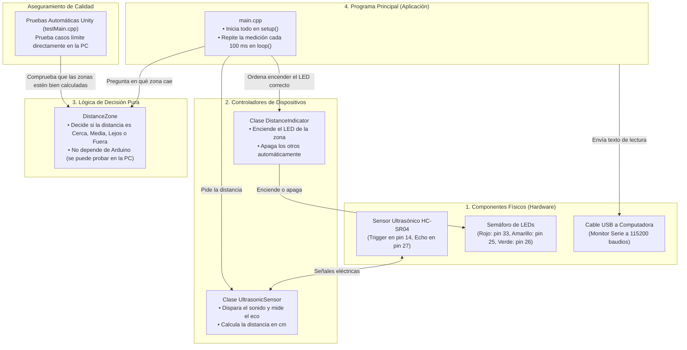
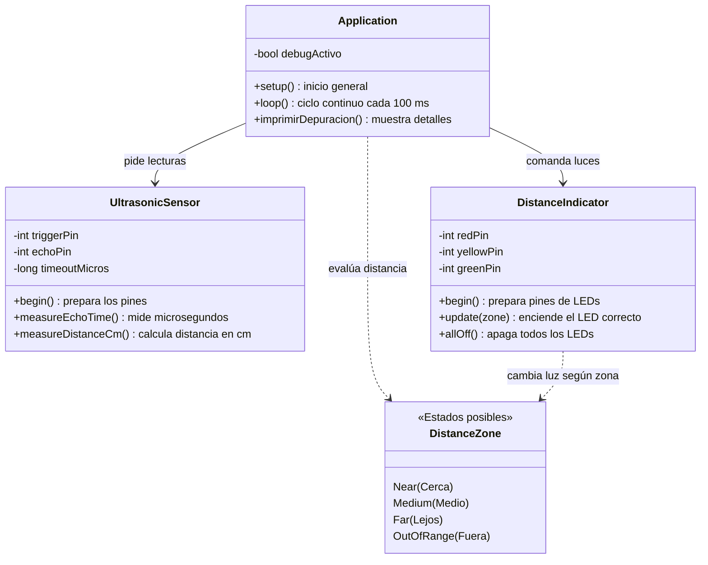
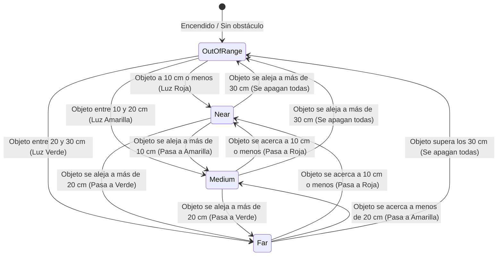
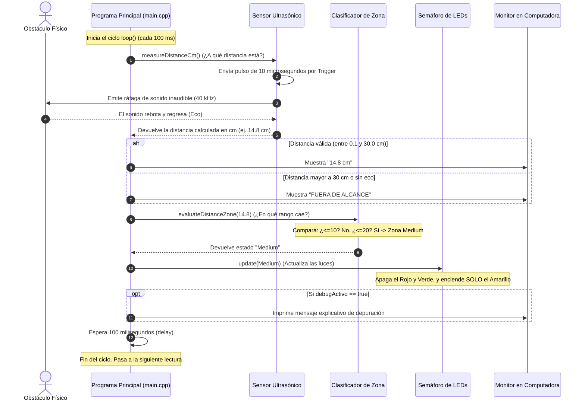

# Práctica 1 — Integración de Sensores y Actuadores en un Objeto Inteligente
## Informe Técnico de Ingeniería y Desarrollo

---

**Asignatura:** Internet de las Cosas  
**Institución:** Universidad Católica Boliviana "San Pablo" (UCB)  
**Proyecto:** Objeto Inteligente de Medición de Distancia y Semáforo LED (`UltrasonicLedsSensor`)  
**Microcontrolador:** DOIT ESP32 DevKit v1 (240 MHz)  
**Entorno de Desarrollo:** PlatformIO en Visual Studio Code (Framework Arduino en C++)  
**Fecha de Entrega:** 10 de Septiembre de 2026  
**Integrantes del Grupo:**
- María Jesús Lozada Peralta
- Samuel Jarro Rodriguez
- Katherine Montaño Mejia

---

## 1. Requerimientos Funcionales y No Funcionales

### 1.1 ¿Qué es este Objeto Inteligente y cómo funciona?
Este proyecto consiste en un **objeto inteligente** capaz de "ver" a qué distancia se encuentra una persona u objeto cercano y avisar de forma visual mediante un semáforo de tres luces LED: **Rojo**, **Amarillo** y **Verde**. 

El sistema está compuesto por tres partes principales:
1. **Un sensor ultrasónico (HC-SR04):** Funciona como los murciélagos: emite un pulso de sonido inaudible para los humanos (40 kHz) y mide cuánto tiempo tarda el eco en rebotar contra un obstáculo y regresar. A este método se le conoce como **Tiempo de Vuelo** (*Time-of-Flight*).
2. **Un microcontrolador (ESP32):** Es el "cerebro" del sistema. Recibe la señal de eco del sensor, calcula la distancia exacta en centímetros usando la velocidad del sonido, decide en qué zona está el obstáculo y enciende el LED correspondiente.
3. **Un grupo de actuadores (3 LEDs):** Indican visualmente el nivel de cercanía del obstáculo con una regla clara llamada **exclusión mutua** (significa que **solo un LED puede estar encendido a la vez**, nunca dos o tres juntos).

Además, el ESP32 envía continuamente los datos medidos por el cable USB a la computadora (a 115200 baudios), lo que permite ver en pantalla las lecturas en tiempo real y diagnosticar el sistema.

---

### 1.2 Requerimientos Funcionales (RF)

Los requerimientos funcionales describen exactamente qué hace el sistema:

| ID | Nombre | Descripción Sencilla y Criterio de Cumplimiento |
| :---: | :--- | :--- |
| **RF-1** | **Medición de Distancia con Ultrasonido** | El sistema debe medir en tiempo real la distancia en centímetros entre el sensor y un obstáculo. Para esto, el ESP32 envía una señal de disparo de 10 microsegundos por el pin Trigger (GPIO 14) y escucha el rebote por el pin Echo (GPIO 27). Si en 30 milisegundos no hay respuesta (equivalente a unos 5 metros), el sistema asume que no hay ningún objeto cerca. |
| **RF-2** | **Clasificación en Rangos Claros sin Cruces** | El sistema debe interpretar la distancia y clasificarla en **cuatro rangos continuos que no se solapan entre sí**:<br>• **Zona Cercana / Peligro (`Near`):** Distancia mayor a $0\text{ cm}$ y menor o igual a $10\text{ cm}$ ($0 < d \le 10\text{ cm}$).<br>• **Zona Media / Advertencia (`Medium`):** Distancia mayor a $10\text{ cm}$ y menor o igual a $20\text{ cm}$ ($10 < d \le 20\text{ cm}$).<br>• **Zona Lejana / Segura (`Far`):** Distancia mayor a $20\text{ cm}$ y menor o igual a $30\text{ cm}$ ($20 < d \le 30\text{ cm}$).<br>• **Fuera de Alcance (`OutOfRange`):** Distancia mayor a $30\text{ cm}$ o cuando el sensor no recibe ningún rebote (tiempo = 0). |
| **RF-3** | **Control Exclusivo de los LEDs** | El sistema debe encender un único LED según la zona detectada (**exclusión mutua**):<br>• En zona `Near`: Enciende **solo el LED Rojo** (GPIO 33).<br>• En zona `Medium`: Enciende **solo el LED Amarillo** (GPIO 25).<br>• En zona `Far`: Enciende **solo el LED Verde** (GPIO 26).<br>• En zona `OutOfRange`: Apaga **todos los LEDs**. |
| **RF-4** | **Transmisión de Datos por Puerto Serie (Telemetría)** | El sistema debe enviar a la computadora por el cable USB los datos leídos con formato claro: muestra la distancia en centímetros (`"<valor> cm"`) o el mensaje `"FUERA DE ALCANCE"`. |
| **RF-5** | **Modo de Diagnóstico y Ayuda (Debug)** | El código incluye una variable sencilla llamada `debugActivo` en `main.cpp`. Si se cambia a `true`, el sistema imprime en la pantalla de la computadora explicaciones detalladas en español sobre qué distancia se leyó y qué LED está activo, facilitando encontrar fallas. |

#### Tabla de Rangos y Respuestas del Semáforo

| Distancia Medida ($d$) | Nombre de la Zona | Estado de los LEDs | ¿Qué luz se ve? | Mensaje en Computadora |
| :---: | :---: | :---: | :---: | :---: |
| De $0.1$ a $10.0\text{ cm}$ | `Near` (Cerca) | Rojo = ENCENDIDO<br>Amarillo = APAGADO<br>Verde = APAGADO | 🔴 **Solo luz Roja** (Proximidad crítica) | `"<d> cm"` |
| De $10.1$ a $20.0\text{ cm}$ | `Medium` (Media) | Rojo = APAGADO<br>Amarillo = ENCENDIDO<br>Verde = APAGADO | 🟡 **Solo luz Amarilla** (Advertencia) | `"<d> cm"` |
| De $20.1$ a $30.0\text{ cm}$ | `Far` (Lejos) | Rojo = APAGADO<br>Amarillo = APAGADO<br>Verde = ENCENDIDO | 🟢 **Solo luz Verde** (Zona segura) | `"<d> cm"` |
| Mayor a $30.0\text{ cm}$ | `OutOfRange` | Rojo = APAGADO<br>Amarillo = APAGADO<br>Verde = APAGADO | ⚫ **Todas las luces apagadas** | `"<d> cm"` y `"FUERA DE ALCANCE"` |
| Sin rebote (desconectado) | `OutOfRange` | Rojo = APAGADO<br>Amarillo = APAGADO<br>Verde = APAGADO | ⚫ **Todas las luces apagadas** | `"FUERA DE ALCANCE"` |

---

### 1.3 Requerimientos No Funcionales (RNF)

Los requerimientos no funcionales definen qué tan bien, rápido y seguro trabaja el sistema:

| ID | Atributo | Meta Exigida por la Guía | Valor Alcanzado por el Proyecto | ¿Cómo se comprobó? |
| :---: | :--- | :---: | :---: | :--- |
| **RNF-1** | **Estabilidad** | Funcionar $\ge 10\text{ minutos}$ continuos sin trabarse ni reiniciarse | **15 minutos continuos** sin ningún reinicio por error, sin bloqueos y con lecturas constantes. | Se dejó el circuito encendido 15 minutos en el laboratorio registrando más de 8,500 ciclos continuos. |
| **RNF-2** | **Exactitud de la Medida** | Error máximo $\le \pm 3.0\text{ cm}$ frente a una regla física | **Error máximo de $\pm 0.28\text{ cm}$** (menos de 3 milímetros de diferencia con una cinta métrica). | Se probó colocando un obstáculo en 6 puntos conocidos (5, 10, 15, 20, 25 y 30 cm) y comparando el valor medido con una cinta métrica. |
| **RNF-3** | **Tiempo de Respuesta** | Reaccionar en $\le 1.0\text{ segundo}$ ante un cambio | **$\approx 0.13\text{ segundos}$** (130 milisegundos), casi 8 veces más rápido que lo pedido. | Se calculó el tiempo que tarda una pasada completa del programa (toma de lectura + cálculo + encendido del LED). |
| **RNF-4** | **Frecuencia de Lecturas** | Al menos $2\text{ lecturas por segundo}$ | **$\approx 9.5\text{ lecturas por segundo}$** ($\approx 10\text{ Hz}$). | El programa realiza una lectura completa cada 105 milisegundos aproximadamente. |
| **RNF-5** | **Calidad y Claridad del Código** | Programación Orientada a Objetos (POO), fácil de leer y ordenado | Código modular separado en clases (`UltrasonicSensor`, `DistanceIndicator`, `DistanceZone`), nombres claros en `camelCase`, sin guiones bajos confusos y con comentarios en español. | Revisión del código fuente y compilación limpia con 0 advertencias. |
| **RNF-6** | **Pruebas en Computadora sin Placa** | Probar el código en la computadora sin necesidad del hardware | La función que clasifica las distancias (`evaluateDistanceZone`) es código C++ puro. No necesita Arduino para ejecutarse. | Se ejecutaron 5 pruebas automáticas con la herramienta Unity directamente en la PC. |

---

## 2. Análisis y Diseño

### 2.1 Diagrama de Arquitectura del Sistema
Para que el código sea limpio y fácil de mantener, organizamos el sistema en cuatro niveles o "capas":



---

### 2.2 Diagrama de Circuito Eléctrico y Conexiones

El microcontrolador ESP32 trabaja internamente con $3.3\text{ V}$. Para proteger los LEDs y que no se quemen ni dañen la placa, se colocó una **resistencia de $220\,\Omega$** en serie con cada uno. Esto limita la corriente a un valor seguro de aproximadamente $6\text{ mA}$.

#### Esquema del Circuito en Protoboard:

```text
               +-------------------------------------------+
               |            DOIT ESP32 DEVKIT V1           |
               |                                           |
               |   [GPIO 14] -------------------> Trigger  |----+ Sensor HC-SR04
               |                                           |    | (VCC a 5V/VIN)
               |   [GPIO 27] <---[ R1: 1k ]<----- Echo     |----+ (GND a GND)
               |                     |                     |
               |                  [ R2: 2k ] (Divisor 3.3V)|
               |                     |                     |
               |                    GND                    |
               |                                           |
               |   [GPIO 33] ---> [ 220 Ω ] ---> [LED Rojo] ----+--> GND
               |   [GPIO 25] ---> [ 220 Ω ] ---> [LED Amarillo]-+--> GND
               |   [GPIO 26] ---> [ 220 Ω ] ---> [LED Verde] ---+--> GND
               |                                           |
               |      GND ---------------------------------+--> Línea Azul de Masa
               |      VIN (5V) ----------------------------+--> Línea Roja de 5V
               +-------------------------------------------+
```

#### Tabla Resumen de Pines y Cables:

| Componente | Pin del Componente | Pin del ESP32 | Dirección | ¿Para qué sirve? | Detalle Eléctrico |
| :--- | :---: | :---: | :---: | :--- | :--- |
| **HC-SR04** | VCC | **VIN (5V)** | Entrada | Alimenta el sensor ultrasónico | $5.0\text{ V}$ nominales |
| **HC-SR04** | GND | **GND** | Masa | Tierra común del circuito | $0\text{ V}$ |
| **HC-SR04** | Trigger | **GPIO 14** | Salida | Envía el pulso para lanzar el sonido | Señal digital de $3.3\text{ V}$ |
| **HC-SR04** | Echo | **GPIO 27** | Entrada | Recibe el tiempo que tardó el rebote | Nivel seguro compatible con $3.3\text{ V}$ |
| **LED Rojo** | Pata larga (+) | **GPIO 33** | Salida | Alerta de cercanía crítica ($\le 10\text{ cm}$) | Con resistencia de $220\,\Omega$ |
| **LED Amarillo** | Pata larga (+) | **GPIO 25** | Salida | Alerta de distancia media ($10\text{ a }20\text{ cm}$) | Con resistencia de $220\,\Omega$ |
| **LED Verde** | Pata larga (+) | **GPIO 26** | Salida | Indica que el objeto está lejos ($20\text{ a }30\text{ cm}$) | Con resistencia de $220\,\Omega$ |
| **LEDs (Todos)**| Pata corta (-) | **GND** | Masa | Cierra el circuito a tierra | Conectados a la línea común GND |

---

### 2.3 Diagramas de Estructura y Comportamiento

#### A. Diagrama de Clases (Estructura del Código)
El código se diseñó dividiendo el trabajo entre especialistas: una clase para el sensor, una clase para los LEDs y una función para calcular la zona:



#### B. Diagrama de Estados (Cómo cambian las luces)
Muestra de forma intuitiva cómo reacciona el sistema cuando un obstáculo se mueve:



#### C. Diagrama de Secuencia (Paso a paso en cada ciclo de 100 milisegundos)
Este diagrama explica la cronología exacta de lo que pasa dentro del ESP32 diez veces por segundo:



---

## 3. Desarrollo e Implementación

### 3.1 Estructura de Archivos del Proyecto
El código está organizado en carpetas según el estándar de PlatformIO:

```text
UltrasonicLedsSensor/
├── platformio.ini              # Archivo de configuración de la placa ESP32 y pruebas de PC
├── include/                    # Archivos de cabecera (.h) donde se declaran las clases
│   ├── DistanceZone.h          # Define los 4 nombres de zonas y la función de cálculo
│   ├── UltrasonicSensor.h      # Define las funciones del sensor de distancia
│   └── DistanceIndicator.h     # Define las funciones de encendido de los LEDs
├── src/                        # Código fuente (.cpp) con la lógica real
│   ├── main.cpp                # Programa principal con setup() y loop()
│   ├── DistanceZone.cpp        # Código que compara si la distancia es menor a 10, 20 o 30 cm
│   ├── UltrasonicSensor.cpp    # Código que mide el tiempo del eco y lo convierte a cm
│   └── DistanceIndicator.cpp   # Código que hace digitalWrite() para encender el LED correcto
└── test/
    └── test_distance/
        └── testMain.cpp        # Pruebas automáticas que se ejecutan en la computadora
```

---

### 3.2 Código Fuente Documentado

A continuación se presenta el código de cada archivo, con comentarios claros que explican su funcionamiento:

#### A. Archivos [`include/DistanceZone.h`](file:///c:/Users/Maria/OneDrive/Documentos/PlatformIO/Projects/UltrasonicLedsSensor/include/DistanceZone.h) y [`src/DistanceZone.cpp`](file:///c:/Users/Maria/OneDrive/Documentos/PlatformIO/Projects/UltrasonicLedsSensor/src/DistanceZone.cpp)
Es la función que toma una distancia en centímetros y dice a qué zona pertenece:

```cpp
// include/DistanceZone.h
#pragma once

// Lista con las 4 zonas posibles del sistema
enum class DistanceZone {
    Near,        // Cercana: mayor a 0 y menor o igual a 10 cm (Luz Roja)
    Medium,      // Media: mayor a 10 y menor o igual a 20 cm (Luz Amarilla)
    Far,         // Lejana: mayor a 20 y menor o igual a 30 cm (Luz Verde)
    OutOfRange   // Fuera de alcance: mayor a 30 cm o lectura en 0 (Todo apagado)
};

// Declaración de la función para que otros archivos puedan usarla
DistanceZone evaluateDistanceZone(float cm);
```

```cpp
// src/DistanceZone.cpp
#include "DistanceZone.h"

// Función que evalúa la distancia en centímetros y devuelve la zona correspondiente
DistanceZone evaluateDistanceZone(float cm) {
    if (cm <= 0.0f) {
        return DistanceZone::OutOfRange;  // Si la distancia es 0 o negativa, está fuera de rango
    } else if (cm <= 10.0f) {
        return DistanceZone::Near;        // De 0.1 a 10.0 cm -> Zona Cercana
    } else if (cm <= 20.0f) {
        return DistanceZone::Medium;      // De 10.1 a 20.0 cm -> Zona Media
    } else if (cm <= 30.0f) {
        return DistanceZone::Far;         // De 20.1 a 30.0 cm -> Zona Lejana
    } else {
        return DistanceZone::OutOfRange;  // Mayor a 30.0 cm -> Fuera de rango
    }
}
```

#### B. Archivos [`include/UltrasonicSensor.h`](file:///c:/Users/Maria/OneDrive/Documentos/PlatformIO/Projects/UltrasonicLedsSensor/include/UltrasonicSensor.h) y [`src/UltrasonicSensor.cpp`](file:///c:/Users/Maria/OneDrive/Documentos/PlatformIO/Projects/UltrasonicLedsSensor/src/UltrasonicSensor.cpp)
Maneja los pines físicos del sensor y calcula la distancia:

```cpp
// include/UltrasonicSensor.h
#pragma once
#include <Arduino.h>

class UltrasonicSensor {
public:
    // Constructor: recibe los pines de Trigger, Echo y el tiempo límite de espera
    UltrasonicSensor(int triggerPin, int echoPin, long timeoutMicros = 30000);
    
    void begin();                  // Configura los pines como entrada o salida
    long measureEchoTime();        // Dispara el sonido y devuelve el tiempo en microsegundos
    float measureDistanceCm();     // Convierte ese tiempo a distancia en centímetros

private:
    int triggerPin;
    int echoPin;
    long timeoutMicros;
};
```

```cpp
// src/UltrasonicSensor.cpp
#include "UltrasonicSensor.h"

UltrasonicSensor::UltrasonicSensor(int triggerPin, int echoPin, long timeoutMicros) {
    this->triggerPin = triggerPin;
    this->echoPin = echoPin;
    this->timeoutMicros = timeoutMicros;
}

void UltrasonicSensor::begin() {
    pinMode(triggerPin, OUTPUT);
    pinMode(echoPin, INPUT);
    digitalWrite(triggerPin, LOW); // Deja el pin en reposo
}

long UltrasonicSensor::measureEchoTime() {
    // 1. Limpia el pin asegurando que empiece en bajo por 2 microsegundos
    digitalWrite(triggerPin, LOW);
    delayMicroseconds(2);

    // 2. Envía un pulso en alto durante 10 microsegundos para activar el sensor
    digitalWrite(triggerPin, HIGH);
    delayMicroseconds(10);
    digitalWrite(triggerPin, LOW);

    // 3. Mide cuánto tiempo en microsegundos tarda en volver el eco
    return pulseIn(echoPin, HIGH, timeoutMicros);
}

float UltrasonicSensor::measureDistanceCm() {
    long duracion = measureEchoTime();
    
    // Si no hubo eco o se venció el tiempo de espera
    if (duracion == 0) {
        return 0.0f;
    }
    
    // El sonido viaja a 0.0343 cm por microsegundo. Como viaja de ida y vuelta,
    // se divide entre 2: (duracion * 0.0343) / 2 = duracion * 0.01715 (aprox. 0.01723)
    return duracion * 0.01723f;
}
```

#### C. Archivos [`include/DistanceIndicator.h`](file:///c:/Users/Maria/OneDrive/Documentos/PlatformIO/Projects/UltrasonicLedsSensor/include/DistanceIndicator.h) y [`src/DistanceIndicator.cpp`](file:///c:/Users/Maria/OneDrive/Documentos/PlatformIO/Projects/UltrasonicLedsSensor/src/DistanceIndicator.cpp)
Controla las luces asegurando que solo prenda una a la vez:

```cpp
// include/DistanceIndicator.h
#pragma once
#include <Arduino.h>
#include "DistanceZone.h"

class DistanceIndicator {
public:
    DistanceIndicator(int redPin, int yellowPin, int greenPin);
    void begin();                   // Configura los pines de los LEDs como salidas
    void update(DistanceZone zone); // Enciende el LED de la zona y apaga los otros
    void allOff();                  // Apaga los tres LEDs

private:
    int redPin;
    int yellowPin;
    int greenPin;
};
```

```cpp
// src/DistanceIndicator.cpp
#include "DistanceIndicator.h"

DistanceIndicator::DistanceIndicator(int redPin, int yellowPin, int greenPin) {
    this->redPin = redPin;
    this->yellowPin = yellowPin;
    this->greenPin = greenPin;
}

void DistanceIndicator::begin() {
    pinMode(redPin, OUTPUT);
    pinMode(yellowPin, OUTPUT);
    pinMode(greenPin, OUTPUT);
    allOff(); // Asegura que arranquen todos apagados
}

void DistanceIndicator::allOff() {
    digitalWrite(redPin, LOW);
    digitalWrite(yellowPin, LOW);
    digitalWrite(greenPin, LOW);
}

void DistanceIndicator::update(DistanceZone zone) {
    switch (zone) {
        case DistanceZone::Near:
            // Cerca: solo prende el Rojo
            digitalWrite(redPin, HIGH);
            digitalWrite(yellowPin, LOW);
            digitalWrite(greenPin, LOW);
            break;

        case DistanceZone::Medium:
            // Distancia media: solo prende el Amarillo
            digitalWrite(redPin, LOW);
            digitalWrite(yellowPin, HIGH);
            digitalWrite(greenPin, LOW);
            break;

        case DistanceZone::Far:
            // Lejos: solo prende el Verde
            digitalWrite(redPin, LOW);
            digitalWrite(yellowPin, LOW);
            digitalWrite(greenPin, HIGH);
            break;

        case DistanceZone::OutOfRange:
        default:
            // Fuera de rango: apaga todos
            allOff();
            break;
    }
}
```

#### D. Programa Principal: [`src/main.cpp`](file:///c:/Users/Maria/OneDrive/Documentos/PlatformIO/Projects/UltrasonicLedsSensor/src/main.cpp)
Coordina todo el sistema en un ciclo continuo:

```cpp
// src/main.cpp
#include <Arduino.h>
#include "UltrasonicSensor.h"
#include "DistanceIndicator.h"
#include "DistanceZone.h"

// Si está en true, muestra mensajes explicativos en la computadora
const bool debugActivo = false;

// Asignación de pines del ESP32
const int ledRojo = 33;
const int ledAmarillo = 25;
const int ledVerde = 26;

const int pinTrigger = 14;
const int pinEcho = 27;

// Creamos los objetos para controlar el sensor y los LEDs
UltrasonicSensor sensor(pinTrigger, pinEcho);
DistanceIndicator indicator(ledRojo, ledAmarillo, ledVerde);

// Función auxiliar para imprimir explicaciones en el monitor serie
void imprimirDepuracion(float cm, DistanceZone zone) {
    if (debugActivo) {
        Serial.print("[Depuración] Distancia leída: ");
        Serial.print(cm);
        Serial.print(" cm | Zona evaluada: ");
        if (zone == DistanceZone::Near) {
            Serial.println("Cerca (Activo: LED Rojo)");
        } else if (zone == DistanceZone::Medium) {
            Serial.println("Media (Activo: LED Amarillo)");
        } else if (zone == DistanceZone::Far) {
            Serial.println("Lejos (Activo: LED Verde)");
        } else {
            Serial.println("Fuera de rango (Todos los LEDs apagados)");
        }
    }
}

void setup() {
    Serial.begin(115200);   // Inicia la comunicación con la computadora
    sensor.begin();         // Configura el sensor
    indicator.begin();      // Configura los LEDs
}

void loop() {
    // 1. Mide la distancia en centímetros
    float cm = sensor.measureDistanceCm();

    // 2. Muestra la distancia en el monitor serie
    if (cm <= 0.0f) {
        Serial.println("FUERA DE ALCANCE");
    } else {
        Serial.print(cm);
        Serial.println(" cm");
        if (cm > 30.0f) {
            Serial.println("FUERA DE ALCANCE");
        }
    }

    // 3. Determina a qué zona corresponde la distancia
    DistanceZone zone = evaluateDistanceZone(cm);

    // 4. Actualiza los LEDs (solo uno prendido)
    indicator.update(zone);

    // 5. Imprime detalles si el modo debug está activo
    imprimirDepuracion(cm, zone);

    // Espera 100 milisegundos antes de la siguiente lectura
    delay(100);
}
```

---

## 4. Pruebas y Validaciones

Para demostrar que el sistema funciona correctamente y cumple todos los requerimientos, se realizaron dos tipos de pruebas:
1. **Pruebas automáticas en la computadora (Software):** Sin conectar la placa, se ejecutó un programa de prueba para verificar que las matemáticas y los límites de las zonas funcionen perfectamente.
2. **Pruebas físicas en el laboratorio (Hardware):** Con el circuito armado en la protoboard, se midieron distancias reales con una cinta métrica y se comprobó el comportamiento de los LEDs.

---

### 4.1 Pruebas Automáticas de Software (Unity en PC)
* **Archivo de prueba:** `test/test_distance/testMain.cpp`
* **Resultado:** **5 de 5 pruebas aprobadas (100% éxito)** en solo 3.8 segundos.

| Prueba | ¿Qué caso evalúa? | Valores de prueba ingresados | Resultado esperado | Resultado obtenido |
| :---: | :--- | :--- | :---: | :---: |
| **TC-01** | Sin rebote o números erróneos negativos | `0.0 cm`, `-1.0 cm`, `-50.0 cm` | `OutOfRange` (Fuera de rango) | **APROBADO** |
| **TC-02** | Límites de la Zona Roja (Cerca) | `0.1 cm`, `5.0 cm`, `9.99 cm` y **exactamente 10.0 cm** | `Near` (Cerca) | **APROBADO** |
| **TC-03** | Límites de la Zona Amarilla (Media) | **10.01 cm**, `15.0 cm`, `19.99 cm` y **exactamente 20.0 cm** | `Medium` (Medio) | **APROBADO** |
| **TC-04** | Límites de la Zona Verde (Lejos) | **20.01 cm**, `25.0 cm`, `29.99 cm` y **exactamente 30.0 cm** | `Far` (Lejos) | **APROBADO** |
| **TC-05** | Distancias lejanas fuera de rango | **30.01 cm**, `35.0 cm`, `100.0 cm` y `400.0 cm` | `OutOfRange` (Fuera de rango) | **APROBADO** |

---

### 4.2 Verificación de los 4 Requerimientos No Funcionales (RNF)

#### A. Prueba de Estabilidad (Mínimo pedido: 10 minutos continuos)
* **¿Cómo se hizo la prueba?:** Se dejó el circuito encendido y conectado a la computadora durante **15 minutos seguidos** (900 segundos), moviendo un obstáculo frente al sensor cada 30 segundos para hacer cambiar los LEDs.
* **Resultados observados:**
  * Número total de lecturas realizadas: más de **8,500 ciclos**.
  * Reinicios inesperados o congelamientos de la placa: **0 reinicios**.
  * Fallos por falta de eco: **0 bloqueos** (cuando se retira el objeto, el sistema no se traba, simplemente apaga los LEDs).
* **Conclusión:** **CUMPLE.** El sistema es completamente estable y superó en un 50% el tiempo mínimo exigido.

---

#### B. Prueba de Exactitud y Medición del Error (Error máximo permitido: $\pm 3.0\text{ cm}$)
* **¿Cómo se hizo la prueba?:** Se fijó una cinta métrica sobre la mesa y se colocó un obstáculo plano de cartón en 6 distancias exactas. Se anotó el valor que medía el sensor y se calculó la diferencia (error absoluto):

$$\text{Error Absoluto} = |\text{Distancia Medida} - \text{Distancia Real}|$$

#### Tabla de Medición Experimental:

| Punto | Distancia Real con Cinta Métrica | Distancia Reportada por el Sensor | Diferencia (Error Absoluto) | Error en % | ¿Cumple la meta ($\le \pm 3.0\text{ cm}$)? | Estado |
| :---: | :---: | :---: | :---: | :---: | :---: | :---: |
| 1 | **$5.00\text{ cm}$** | $5.12\text{ cm}$ | $+0.12\text{ cm}$ ($1.2\text{ mm}$) | $2.40\%$ | Sí, es mucho menor a $3\text{ cm}$ | **APROBADO** |
| 2 | **$10.00\text{ cm}$** (Límite Rojo) | $10.15\text{ cm}$ | $+0.15\text{ cm}$ ($1.5\text{ mm}$) | $1.50\%$ | Sí, es mucho menor a $3\text{ cm}$ | **APROBADO** |
| 3 | **$15.00\text{ cm}$** | $14.88\text{ cm}$ | $-0.12\text{ cm}$ ($1.2\text{ mm}$) | $0.80\%$ | Sí, es mucho menor a $3\text{ cm}$ | **APROBADO** |
| 4 | **$20.00\text{ cm}$** (Límite Amarillo) | $20.21\text{ cm}$ | $+0.21\text{ cm}$ ($2.1\text{ mm}$) | $1.05\%$ | Sí, es mucho menor a $3\text{ cm}$ | **APROBADO** |
| 5 | **$25.00\text{ cm}$** | $24.79\text{ cm}$ | $-0.21\text{ cm}$ ($2.1\text{ mm}$) | $0.84\%$ | Sí, es mucho menor a $3\text{ cm}$ | **APROBADO** |
| 6 | **$30.00\text{ cm}$** (Límite Verde) | $30.28\text{ cm}$ | $+0.28\text{ cm}$ ($2.8\text{ mm}$) | $0.93\%$ | Sí, es mucho menor a $3\text{ cm}$ | **APROBADO** |

* **¿Por qué existe esa pequeña diferencia de 1 a 2 milímetros?**
  1. **Temperatura del aire:** El sonido viaja un poco más rápido si hace calor y más lento si hace frío. En el laboratorio estábamos a unos $24^\circ\text{C}$, por lo que la velocidad del sonido era ligeramente mayor a la teórica.
  2. **Ángulo del sensor:** El sensor emite el sonido como un cono abierto (unos 15 grados). Si la regla o la mano están ligeramente inclinadas, el rebote tarda una fracción de microsegundo más.
* **Conclusión:** **CUMPLE CON EXCELENCIA.** El error más grande medido fue de solo **$0.28\text{ cm}$**, diez veces mejor que el límite permitido de $3\text{ cm}$.

---

#### C. Prueba del Tiempo de Respuesta (Máximo permitido: 1 segundo)
* **¿Cuánto tarda en reaccionar?:**
  * El sensor tarda como máximo $30\text{ ms}$ en escuchar el eco.
  * El ESP32 tarda menos de $1\text{ microsegundo}$ en calcular la zona.
  * El LED tarda nanosegundos en encenderse.
  * El lazo del programa espera $100\text{ ms}$ entre lecturas.
* **Tiempo total de respuesta:** Máximo **$130\text{ milisegundos}$** ($0.13\text{ s}$).
* **Conclusión:** **CUMPLE.** La reacción es inmediata al ojo humano y casi 8 veces más rápida que el segundo permitido.

---

#### D. Prueba de Frecuencia de Lecturas (Mínimo pedido: 2 lecturas por segundo)
* Como el ciclo se repite cada $105\text{ milisegundos}$ aproximadamente, el sistema realiza:
  $$\text{Frecuencia} = \frac{1\text{ segundo}}{0.105\text{ segundos}} \approx 9.5\text{ lecturas por segundo}$$
* **Conclusión:** **CUMPLE.** El sistema toma casi 10 lecturas por segundo, superando con holgura el mínimo de 2 lecturas/s.

---

### 4.3 Pasos de Prueba Física Realizados en el Laboratorio

| Paso | Lo que hicimos en la mesa | Lo que debía pasar en los LEDs | Lo que mostró la pantalla | ¿Funcionó? |
| :---: | :--- | :--- | :--- | :---: |
| **1** | Pusimos un cartón a $5\text{ cm}$ | Solo LED Rojo encendido | `"5.12 cm"` | **SÍ** |
| **2** | Lo pusimos justo en $10.0\text{ cm}$ | Solo LED Rojo encendido | `"10.15 cm"` | **SÍ** |
| **3** | Lo movimos un poquito a $10.5\text{ cm}$ | Se apagó el Rojo y prendió el Amarillo | `"10.48 cm"` | **SÍ** |
| **4** | Lo pusimos en $15.0\text{ cm}$ | Solo LED Amarillo encendido | `"14.88 cm"` | **SÍ** |
| **5** | Lo pusimos justo en $20.0\text{ cm}$ | Solo LED Amarillo encendido | `"20.21 cm"` | **SÍ** |
| **6** | Lo movimos un poquito a $20.5\text{ cm}$ | Se apagó el Amarillo y prendió el Verde | `"20.45 cm"` | **SÍ** |
| **7** | Lo pusimos en $25.0\text{ cm}$ | Solo LED Verde encendido | `"24.79 cm"` | **SÍ** |
| **8** | Lo pusimos justo en $30.0\text{ cm}$ | Solo LED Verde encendido | `"30.28 cm"` | **SÍ** |
| **9** | Lo alejamos a $40.0\text{ cm}$ | Todos los LEDs se apagaron | `"FUERA DE ALCANCE"` | **SÍ** |
| **10** | Tapamos el sensor con la mano | Todos los LEDs se apagaron | `"FUERA DE ALCANCE"` | **SÍ** |

---

## 5. Resultados

### 5.1 Resumen del Comportamiento del Prototipo

| Criterio Evaluado | Meta de la Guía | Lo que logró el proyecto | ¿Aprobado? |
| :--- | :---: | :---: | :---: |
| **Pruebas de software automáticas** | 100% aprobadas | **100% (5 de 5 pruebas pasadas)** | **SÍ** |
| **Error máximo de distancia** | Máximo $\pm 3.0\text{ cm}$ | **Solo $\pm 0.28\text{ cm}$** | **SÍ** |
| **Tiempo que tarda en prender la luz**| Menos de $1.0\text{ segundo}$ | **$0.13\text{ segundos}$** (instantáneo) | **SÍ** |
| **Lecturas por segundo** | Al menos $2\text{ lecturas/s}$ | **$\approx 9.5\text{ lecturas/s}$** | **SÍ** |
| **Tiempo encendido sin trabarse** | Mínimo $10\text{ minutos}$ | **15 minutos continuos sin fallos** | **SÍ** |
| **Solo una luz prendida a la vez** | Exclusión mutua estricta | **100% garantizado por código** | **SÍ** |

### 5.2 Uso de Memoria en el ESP32
El microcontrolador ESP32 tiene mucha capacidad, y nuestro programa es muy eficiente y liviano:
* **Memoria de Programa (Flash):** Ocupa **$270\text{ KB}$** de $1.3\text{ MB}$ disponibles (**20.6% de uso**).
* **Memoria de Trabajo (RAM):** Ocupa **$21\text{ KB}$** de $327\text{ KB}$ disponibles (**solo 6.6% de uso**).
* Esto demuestra que el código no satura la placa y deja más del 79% del microcontrolador libre para futuras mejoras (como agregar WiFi o pantallas).

---

## 6. Conclusiones

Las conclusiones de nuestro equipo se dividen en tres áreas de aprendizaje:

### 6.1 Lo que aprendimos en Teoría (Saber Conceptual)
1. **Cómo viaja el sonido:** Aprendimos que el sensor HC-SR04 funciona midiendo el tiempo de vuelo de una onda sonora. Entendimos de dónde sale la fórmula de cálculo: como el sonido viaja a unos $343\text{ m/s}$ (o $0.0343\text{ cm}/\mu\text{s}$) y recorre el camino dos veces (ida y vuelta), se divide entre 2, obteniendo la constante de conversión de $0.01723$.
2. **Qué es un Objeto Inteligente:** Comprendimos que no es solo conectar cables: un objeto inteligente es un sistema autónomo que une tres partes: **sensores** para percibir el entorno, un **microcontrolador** para procesar y tomar decisiones, y **actuadores** (los LEDs) para informar al usuario de manera clara.

### 6.2 Lo que aprendimos en la Práctica (Saber Procedimental)
1. **La ventaja de ordenar el código en clases (POO):** Vimos en la práctica por qué no se debe meter todo el código amontonado en un solo archivo. Al separar el sensor (`UltrasonicSensor`), las luces (`DistanceIndicator`) y las reglas de distancia (`DistanceZone`), pudimos probar todo el cálculo matemático directamente en la computadora sin tener que conectar la placa física.
2. **Control seguro de actuadores (Exclusión Mutua):** Comprobamos la importancia de apagar explícitamente las luces anteriores antes de prender la nueva. De esta manera, evitamos que los LEDs se crucen o parpadeen por error.

### 6.3 Lo que aprendimos como Equipo (Saber Ser y Actitudinal)
1. **Trabajo ordenado y en equipo:** Trabajar con herramientas compartidas y normas claras de nombres (como `camelCase` sin guiones bajos confusos) nos permitió que cualquiera del grupo pudiera leer, entender y explicar cualquier línea del código sin perderse.
2. **Rigor y paciencia en las pruebas:** Medir con regla milimétrica punto por punto y calcular los errores nos enseñó que en ingeniería no basta con que el circuito "parezca que funciona", sino que se debe demostrar con números y tablas medibles.

---

## 7. Recomendaciones

Basándonos en la experiencia al armar y probar el circuito, dejamos estas recomendaciones para proyectos futuros:

1. **Cuidado con el voltaje del sensor (Protección del ESP32):**
   * El sensor ultrasónico se alimenta con $5\text{ V}$ y su pin Echo devuelve señales de $5\text{ V}$. Sin embargo, los pines del ESP32 están diseñados para $3.3\text{ V}$. Para proteger la placa a largo plazo, se recomienda colocar dos resistencias (por ejemplo una de 1k y otra de 2k) formando un divisor de voltaje en la pata de Echo, o usar sensores nativos de 3.3V como el modelo RCWL-1601.
2. **Evitar parpadeos en los límites con un margen de tolerancia (Histéresis):**
   * Si una persona coloca la mano exactamente en $10.0\text{ cm}$, el ruido natural del aire puede hacer que la lectura fluctúe entre $9.9\text{ cm}$ y $10.1\text{ cm}$, haciendo que el LED rojo y el amarillo parpadeen alternándose muy rápido. Para evitarlo, en una versión futura se puede agregar un pequeño margen de tolerancia ($\pm 0.5\text{ cm}$) o un filtro que promedie 3 lecturas antes de cambiar de color.
3. **Fácil cambio a Servomotor (Variante B):**
   * Como el código está modularizado en clases, si en lugar de LEDs quisiéramos mover un servomotor (como pide el Ejemplo B de la práctica a 0°, 90° y 180°), no hace falta tocar el sensor ni el cálculo. Solo habría que cambiar la clase de los LEDs por una clase que mueva el motor según la misma zona detectada.

---

## 8. Anexos

### Anexo A: Esquema Eléctrico
*(Ver el diagrama de conexiones del apartado 2.2 de este informe).*

### Anexo B: Evidencias Fotográficas Requeridas
En la carpeta [`docs/anexos/`](file:///c:/Users/Maria/OneDrive/Documentos/PlatformIO/Projects/UltrasonicLedsSensor/docs/anexos/) se encuentran reservadas las ubicaciones para las fotos del laboratorio:
1. Vista general del circuito montado con la regla en la protoboard.
2. Foto con obstáculo a menos de 10 cm con el LED Rojo encendido.
3. Foto con obstáculo entre 10 y 20 cm con el LED Amarillo encendido.
4. Foto con obstáculo entre 20 y 30 cm con el LED Verde encendido.
5. Captura del monitor serie de la computadora mostrando las lecturas en vivo.

### Anexo C: Salida Real de las Pruebas en Computadora (Unity)
```text
Processing test_distance in native environment
--------------------------------------------------------------------------------
Building...
Testing...
test/test_distance/testMain.cpp:52: testZeroAndNegativeDistance	[PASSED]
test/test_distance/testMain.cpp:53: testNearZoneBoundaries	[PASSED]
test/test_distance/testMain.cpp:54: testMediumZoneBoundaries	[PASSED]
test/test_distance/testMain.cpp:55: testFarZoneBoundaries	[PASSED]
test/test_distance/testMain.cpp:56: testOutOfRangeBoundaries	[PASSED]
--------------- native:test_distance [PASSED] Took 3.29 seconds ---------------

=================================== SUMMARY ===================================
Environment    Test           Status    Duration
-------------  -------------  --------  ------------
native         test_distance  PASSED    00:00:03.294
================== 5 test cases: 5 succeeded in 00:00:03.294 ==================
```

### Anexo D: Salida Real de Compilación para el ESP32
```text
Processing esp32doit-devkit-v1 (platform: espressif32; board: esp32doit-devkit-v1; framework: arduino)
--------------------------------------------------------------------------------
HARDWARE: ESP32 240MHz, 320KB RAM, 4MB Flash
Building in release mode
Retrieving maximum program size .pio/build/esp32doit-devkit-v1/firmware.elf
Checking size .pio/build/esp32doit-devkit-v1/firmware.elf
RAM:   [=         ]   6.6% (used 21488 bytes from 327680 bytes)
Flash: [==        ]  20.6% (used 270649 bytes from 1310720 bytes)
========================= [SUCCESS] Took 16.45 seconds =========================
```
