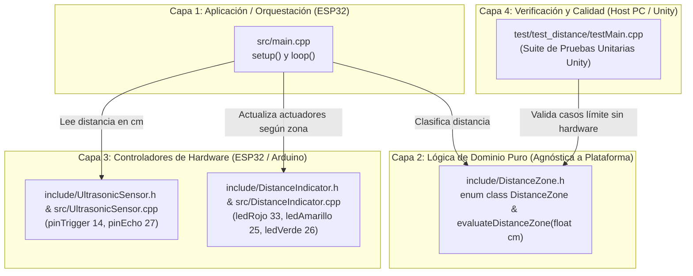

---
name: 'UltrasonicLedsSensor'
type: architecture-spine
purpose: build-substrate
altitude: feature
paradigm: 'Modular Layered Architecture (Hardware Abstraction + Pure Domain Separation)'
scope: 'Firmware embebido ESP32, modelo de clases, telemetria serie y suite de pruebas unitarias'
status: final
created: '2026-09-05'
updated: '2026-09-06'
binds: [FR-1, FR-2, FR-3, FR-4, FR-5, FR-6, FR-7, FR-8, FR-9, FR-10, FR-11, FR-12, FR-13, FR-14, FR-15, FR-16, FR-17, FR-18, FR-19, FR-20, FR-21, NFR-1, NFR-2, NFR-3, NFR-4]
sources: ['_bmad-output/planning-artifacts/prds/prd-UltrasonicLedsSensor-2026-09-05/prd.md']
companions: ['documentacion-tecnica-sistema.md']
---

# Architecture Spine — UltrasonicLedsSensor

## 1. Design Paradigm

El sistema adopta una **Arquitectura Modular en Capas (Modular Layered Architecture)** con separación estricta entre **Lógica de Dominio Pura** y **Capa de Abstracción de Hardware (HAL)**, utilizando C++ básico, limpio y sin guiones bajos:



---

## 2. Invariants & Rules (Decisiones Arquitectónicas)

### AD-1 [ADOPTED] — Invariante de Conexión de Hardware
- **Binds:** `FR-1, FR-11, NFR-4`
- **Prevents:** Desconexión o reasignación arbitraria de pines que rompa la compatibilidad con el circuito físico existente.
- **Rule:** Los pines GPIO del ESP32 quedan fijados de forma inmutable:
  * Sensor Ultrasónico: Trigger = **GPIO 14** (Salida), Echo = **GPIO 27** (Entrada).
  * LEDs de Señalización: Rojo = **GPIO 33**, Amarillo = **GPIO 25**, Verde = **GPIO 26** (Salidas).

### AD-2 [ADOPTED] — Separación de Lógica Pura para Testabilidad en Host
- **Binds:** `FR-6..FR-10, FR-20, SM-1, SM-3`
- **Prevents:** El acoplamiento entre la lógica de umbrales condicionales y las librerías del microcontrolador (`Arduino.h`, `digitalWrite`, `pulseIn`), lo cual impediría correr tests en la computadora.
- **Rule:** La evaluación de distancias se implementa como función pura C++ que recibe `float cm` y devuelve `DistanceZone`. No incluye dependencias de Arduino y compila limpiamente bajo cualquier compilador C++ estándar (GCC/MinGW/Clang).

### AD-3 [ADOPTED] — Exclusión Mutua Atómica en Señalización
- **Binds:** `FR-12..FR-16, NFR-2`
- **Prevents:** Encendidos simultáneos o solapados de LEDs que confundan al usuario u observador.
- **Rule:** `DistanceIndicator` implementa un método `update(DistanceZone zone)` que apaga de forma atómica y explícita los LEDs inactivos antes de conmutar el LED correspondiente al estado actual.

### AD-4 [ADOPTED] — Depuración Transparente y Comprensible
- **Binds:** `FR-19, FR-20`
- **Prevents:** El uso de macros complejas y crípticas de preprocesador que oscurezcan la legibilidad del código.
- **Rule:** La depuración se controla mediante una variable booleana clara (`const bool debugActivo = false;`) y una función explicativa `imprimirDepuracion(float cm, DistanceZone zone)` con comentarios paso a paso.

### AD-5 [ADOPTED] — Configuración de Entorno Dual en PlatformIO
- **Binds:** `SM-1, SM-3`
- **Prevents:** Conflictos de compilación entre el framework embebido de ESP32 y el framework de pruebas de la máquina host.
- **Rule:** [platformio.ini](file:///c:/Users/Maria/OneDrive/Documentos/PlatformIO/Projects/UltrasonicLedsSensor/platformio.ini) define dos entornos formales:
  * `[env:esp32doit-devkit-v1]`: Compilación para el microcontrolador (plataforma `espressif32`, framework `arduino`, monitor serie `115200`).
  * `[env:native]`: Compilación nativa en host (plataforma `native`) para ejecutar la suite de pruebas `Unity` instantáneamente en PC.

---

## 3. Consistency Conventions

| Dimensión | Convención |
|---|---|
| **Lenguaje y Estándar** | C++11 estándar básico para Arduino ESP32 y entorno nativo. |
| **Nomenclatura de Clases** | PascalCase: `UltrasonicSensor`, `DistanceIndicator`. |
| **Nomenclatura de Tipos** | PascalCase: `enum class DistanceZone { Near, Medium, Far, OutOfRange };` |
| **Nomenclatura de Métodos** | camelCase: `measureDistanceCm()`, `update()`, `evaluateDistanceZone()`. |
| **Variables y Pines** | camelCase sin guiones bajos: `ledRojo`, `ledAmarillo`, `ledVerde`, `pinTrigger`, `pinEcho`, `debugActivo`. |
| **Tipos de Datos Básicos** | Primitivos elementales de C++: `int`, `long`, `float`, `bool`. |
| **Protección de Cabeceras** | Directiva estándar moderna `#pragma once` (sin guiones bajos). |
| **Velocidad de Comunicación** | 115200 baudios en monitor serie y archivos de configuración. |

---

## 4. Stack

| Componente | Versión / Pinned | Justificación |
|---|---|---|
| **Plataforma Embebida** | Espressif 32 (`espressif32`) | Soporte oficial para ESP32 en PlatformIO. |
| **Framework Embebido** | Arduino (`framework = arduino`) | Simplicidad, legibilidad pedagógica y APIs probadas. |
| **Plataforma de Pruebas** | PlatformIO Native (`platform = native`) | Permite correr la suite de tests en milisegundos en la computadora de desarrollo. |
| **Framework de Testing** | Unity (incluido en PlatformIO Core) | Estándar de la industria para pruebas unitarias en C/C++ embebido. |

---

## 5. Structural Seed (Árbol de Componentes)

```text
UltrasonicLedsSensor/
├── platformio.ini                  # Configuración de entornos esp32doit-devkit-v1 y native
├── include/
│   ├── DistanceZone.h              # Tipo enumerado y función pura de clasificación
│   ├── UltrasonicSensor.h          # Definición de la clase del sensor ultrasónico
│   └── DistanceIndicator.h         # Definición de la clase del semáforo LED
├── src/
│   ├── main.cpp                    # Orquestador del firmware embebido (setup y loop)
│   ├── DistanceZone.cpp            # Implementación de la función pura de clasificación
│   ├── UltrasonicSensor.cpp        # Implementación de tiempos y lectura de pulsos
│   └── DistanceIndicator.cpp       # Implementación del control de LEDs con exclusión mutua
└── test/
    └── test_distance/
        └── testMain.cpp            # Suite de pruebas unitarias Unity (casos límite)
```

---

## 6. Deferred (Decisiones Diferidas)
* Modulación PWM o efectos de transición suave en LEDs (innecesario para el semáforo discreto actual).
* Conectividad inalámbrica (WiFi / Bluetooth) o protocolos MQTT/HTTP (se evaluará en futuras asignaturas académicas).
* Filtrado digital con búfer circular o media móvil (diferido para evitar alterar la reactividad directa actual).
