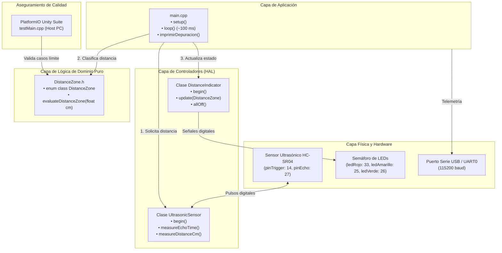
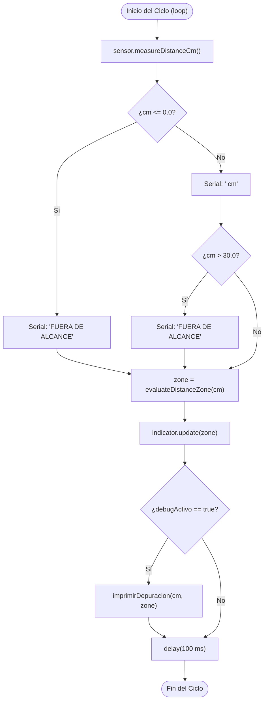

# Memoria Técnica y Documentación Integral del Sistema
## Proyecto: UltrasonicLedsSensor (Medición y Alerta Visual de Proximidad en ESP32)

---

## 1. ANÁLISIS DE REQUERIMIENTOS

### 1.1 Introducción y Propósito del Sistema
El proyecto **UltrasonicLedsSensor** es un sistema embebido interactivo de monitoreo de proximidad en tiempo real implementado sobre el microcontrolador **ESP32** bajo el entorno **PlatformIO** y el framework **Arduino**. El sistema adquiere información de distancia mediante un sensor ultrasónico **HC-SR04**, procesa la información y notifica la cercanía de obstáculos mediante un semáforo de tres LEDs (verde, amarillo y rojo), emitiendo adicionalmente telemetría y diagnósticos por puerto serie.

El propósito principal del proyecto es de carácter **académico y formativo**. Está concebido como un caso de estudio riguroso para la enseñanza y aplicación de **buenas prácticas de ingeniería de software embebido**, demostrando:
* Transición de código monolítico secuencial a **Programación Orientada a Objetos (POO)** limpia, didáctica y en C++ básico.
* Adopción estricta de convenciones de código en **camelCase**, con tipos de datos elementales y ausencia total de guiones bajos.
* **Separación de responsabilidades y desacoplamiento de la lógica de negocio**, permitiendo la testabilidad sin dependencias del microcontrolador.
* Implementación de **telemetría estructurada y depuración transparente** mediante variables booleanas y funciones autoexplicativas.
* **Verificación formal dual**: pruebas automáticas unitarias con framework profesional (**Unity**) ejecutables en PC y protocolos de comprobación manual en laboratorio físico.

---

### 1.2 Principios Físicos de Operación
El sensado de proximidad se fundamenta en la cinemática de ondas acústicas ultrasónicas (**Time-of-Flight** o Tiempo de Vuelo):
1. **Emisión acústica:** El microcontrolador comanda al sensor HC-SR04 a emitir una ráfaga de 8 pulsos ultrasónicos a una frecuencia de **40 kHz** (inaudible para el oído humano).
2. **Propagación en el aire:** La onda viaja a través del aire a una velocidad $v \approx 343\,\text{m/s}$ (a 20°C a nivel del mar), equivalente a $0.0343\,\text{cm}/\mu\text{s}$.
3. **Reflexión y eco:** Al chocar contra un obstáculo acústicamente reflectante, la onda rebota y regresa al transductor receptor del sensor.
4. **Cálculo cinemático:** Dado que la onda recorre dos veces la distancia entre el sensor y el objeto (ida y vuelta), la distancia unidireccional $d$ en centímetros se obtiene mediante:
   $$d = \frac{t \times v}{2} = \frac{t \times 0.0343\,\text{cm}/\mu\text{s}}{2} = t \times 0.01715 \approx t \times 0.01723\,\text{cm}$$
   Donde $t$ es el tiempo en microsegundos que el pin de Eco permanece en nivel alto.

---

### 1.3 Requerimientos Funcionales (RF)

| ID | Nombre | Descripción Técnica |
|---|---|---|
| **RF-1** | **Disparo Ultrasónico** | El sistema debe excitar el pin `pinTrigger` (GPIO 14) con un pulso positivo de exactamente $10\,\mu\text{s}$ precedido por una limpieza de $2\,\mu\text{s}$ en nivel bajo. |
| **RF-2** | **Captura de Eco con Timeout** | El sistema debe medir el ancho de pulso en nivel alto del pin `pinEcho` (GPIO 27) con un tiempo límite de espera acotado a $30.000\,\mu\text{s}$ ($30\,\text{ms}$, equivalente a ~5 metros de alcance). |
| **RF-3** | **Cálculo de Distancia Métrica** | El sistema debe convertir la duración del pulso a centímetros multiplicando por la constante cinemática $0.01723$. Si no hay eco (duración = 0), debe identificar la condición de fuera de rango. |
| **RF-4** | **Clasificación por Zonas** | El sistema debe clasificar el valor de distancia de manera determinista en una de cuatro zonas de proximidad discretas: <br>• **Cerca (`DistanceZone::Near`):** $0 < d \le 10.0\,\text{cm}$<br>• **Medio (`DistanceZone::Medium`):** $10.0 < d \le 20.0\,\text{cm}$<br>• **Lejos (`DistanceZone::Far`):** $20.0 < d \le 30.0\,\text{cm}$<br>• **Fuera de Alcance (`DistanceZone::OutOfRange`):** $d > 30.0\,\text{cm}$ o eco nulo ($0\,\mu\text{s}$). |
| **RF-5** | **Señalización Visual Exclusiva** | El sistema debe comandar tres actuadores LED garantizando **exclusión mutua estricta**:<br>• En `Near`: Enciende únicamente el LED Rojo (`ledRojo`, GPIO 33).<br>• En `Medium`: Enciende únicamente el LED Amarillo (`ledAmarillo`, GPIO 25).<br>• En `Far`: Enciende únicamente el LED Verde (`ledVerde`, GPIO 26).<br>• En `OutOfRange`: Apaga simultáneamente todos los LEDs. |
| **RF-6** | **Telemetría UART Estándar** | El sistema debe transmitir continuamente por UART0 a **115200 baudios** el reporte de distancia formateado (`"<valor> cm"` o `"FUERA DE ALCANCE"`). |
| **RF-7** | **Diagnóstico Condicional (Debug)** | El sistema debe incorporar una opción de diagnóstico controlada por la variable booleana `debugActivo` que imprima en consola serie la distancia leída y la zona evaluada en lenguaje claro. |
| **RF-8** | **Cadencia de Muestreo** | El lazo de control debe ejecutarse con una periodicidad aproximada de $100\,\text{ms}$ (~$10\,\text{Hz}$), permitiendo disipar ecos residuales y mantener una respuesta fluida. |

---

### 1.4 Requerimientos No Funcionales (RNF)

* **RNF-1 (Latencia y Tiempo de Respuesta):** El tiempo total transcurrido desde el movimiento del obstáculo hasta la actualización del LED correspondiente debe ser inferior a $150\,\text{ms}$.
* **RNF-2 (Determinismo y Fiabilidad):** La lógica de clasificación debe ser determinista, sin estados inválidos ni desbordamientos numéricos.
* **RNF-3 (Comprensibilidad y Valor Pedagógico):** El código debe ser autoexplicativo, estructurado en clases coherentes, con variables en `camelCase`, tipos de datos primitivos básicos (`int`, `long`, `float`, `bool`) y sin patrones crípticos ni guiones bajos.
* **RNF-4 (Seguridad Eléctrica y Compatibilidad):** Los pines del ESP32 operan a $3.3\,\text{V}$. Los LEDs deben contar con resistencias limitadoras (220 Ω a 330 Ω) para mantener la corriente por debajo de $12\,\text{mA}$ por pin. El pin Echo debe recibir niveles compatibles con $3.3\,\text{V}$.
* **RNF-5 (Testabilidad en Host):** La lógica pura de evaluación de distancias debe poder compilarse y validarse en computadoras estándar sin requerir hardware físico.

---

### 1.5 Restricciones Invariables del Hardware y Circuito
* **Pines GPIO Asignados (Inmutables):**
  * Sensor Trigger: **GPIO 14** (`pinTrigger`, Salida)
  * Sensor Echo: **GPIO 27** (`pinEcho`, Entrada)
  * LED Rojo: **GPIO 33** (`ledRojo`, Salida)
  * LED Amarillo: **GPIO 25** (`ledAmarillo`, Salida)
  * LED Verde: **GPIO 26** (`ledVerde`, Salida)
* **Umbrales Numéricos (Inmutables):** 10.0 cm, 20.0 cm y 30.0 cm exactos.

---

## 2. DISEÑO DEL SISTEMA

### 2.1 Arquitectura General y Diagrama de Bloques
El sistema adopta una **Arquitectura en Capas Modulares** que desacopla el hardware específico del procesamiento lógico:



---

### 2.2 Diagrama de Flujo del Lazo Principal (`loop`)



---

### 2.3 Modelo de Clases (POO)

#### A. Tipo de Dominio Puro: `DistanceZone`
Permite representar simbólicamente los estados del sistema:
```cpp
enum class DistanceZone {
    Near,        // <= 10.0 cm (Peligro / Proximidad crítica)
    Medium,      // > 10.0 cm y <= 20.0 cm (Advertencia)
    Far,         // > 20.0 cm y <= 30.0 cm (Zona segura)
    OutOfRange   // > 30.0 cm o timeout (Inactivo)
};

// Función pura libre de dependencias de Arduino
DistanceZone evaluateDistanceZone(float cm);
```

#### B. Clase `UltrasonicSensor`
Encapsula la física del transductor ultrasónico con variables camelCase y tipos elementales:
* **Atributos privados:**
  * `int triggerPin`: Pin GPIO de disparo (14).
  * `int echoPin`: Pin GPIO de eco (27).
  * `long timeoutMicros`: Tiempo máximo de espera en microsegundos ($30.000\,\mu\text{s}$).
* **Métodos públicos:**
  * `UltrasonicSensor(int triggerPin, int echoPin, long timeoutMicros = 30000)`: Constructor.
  * `void begin()`: Configura `pinMode` para Trigger y Echo.
  * `long measureEchoTime()`: Dispara pulso de $10\,\mu\text{s}$ y mide duración.
  * `float measureDistanceCm()`: Retorna la distancia calculada en centímetros.

#### C. Clase `DistanceIndicator`
Encapsula la señalización visual y garantiza **exclusión mutua**:
* **Atributos privados:**
  * `int redPin`: Pin GPIO del LED Rojo (33).
  * `int yellowPin`: Pin GPIO del LED Amarillo (25).
  * `int greenPin`: Pin GPIO del LED Verde (26).
* **Métodos públicos:**
  * `DistanceIndicator(int redPin, int yellowPin, int greenPin)`: Constructor.
  * `void begin()`: Configura `pinMode` como salidas y apaga los LEDs.
  * `void update(DistanceZone zone)`: Conmutación atómica garantizando exclusión mutua.
  * `void allOff()`: Apaga simultáneamente los tres actuadores.

---

### 2.4 Matriz de Estados de los Actuadores

| Condición Lógica | `DistanceZone` | LED Rojo (`ledRojo`) | LED Amarillo (`ledAmarillo`) | LED Verde (`ledVerde`) | Mensaje Serial |
|---|---|:---:|:---:|:---:|---|
| $0 < d \le 10.0\,\text{cm}$ | `Near` | **HIGH** | LOW | LOW | `"<cm> cm"` |
| $10.0 < d \le 20.0\,\text{cm}$ | `Medium` | LOW | **HIGH** | LOW | `"<cm> cm"` |
| $20.0 < d \le 30.0\,\text{cm}$ | `Far` | LOW | LOW | **HIGH** | `"<cm> cm"` |
| $d > 30.0\,\text{cm}$ | `OutOfRange` | LOW | LOW | LOW | `"FUERA DE ALCANCE"` |
| $d = 0$ (Sin eco / Timeout) | `OutOfRange` | LOW | LOW | LOW | `"FUERA DE ALCANCE"` |

---

## 3. IMPLEMENTACIÓN

### 3.1 Estructura del Proyecto PlatformIO
```text
UltrasonicLedsSensor/
├── platformio.ini                      # Configuración de entornos ESP32 y Native
├── include/
│   ├── DistanceZone.h                  # Definición del enum y función pura de clasificación
│   ├── UltrasonicSensor.h              # Cabecera de la clase UltrasonicSensor
│   └── DistanceIndicator.h             # Cabecera de la clase DistanceIndicator
├── src/
│   ├── main.cpp                        # Orquestador del firmware (setup y loop)
│   ├── DistanceZone.cpp                # Implementación de evaluateDistanceZone()
│   ├── UltrasonicSensor.cpp            # Implementación de UltrasonicSensor
│   └── DistanceIndicator.cpp           # Implementación de DistanceIndicator
└── test/
    └── test_distance/
        └── testMain.cpp                # Suite de pruebas unitarias Unity
```

---

### 3.2 Configuración del Entorno Dual (`platformio.ini`)
```ini
[env:esp32doit-devkit-v1]
platform = espressif32
board = esp32doit-devkit-v1
framework = arduino
monitor_speed = 115200

[env:native]
platform = native
test_framework = unity
test_build_src = yes
build_src_filter = -<*> +<DistanceZone.cpp>
build_flags = -std=c++11
```

---

### 3.3 Implementación de Módulos C++

#### Módulo de Dominio (`DistanceZone.h` / `DistanceZone.cpp`):
```cpp
// include/DistanceZone.h
#pragma once

enum class DistanceZone {
    Near,
    Medium,
    Far,
    OutOfRange
};

DistanceZone evaluateDistanceZone(float cm);
```
```cpp
// src/DistanceZone.cpp
#include "DistanceZone.h"

DistanceZone evaluateDistanceZone(float cm) {
    if (cm <= 0.0f) {
        return DistanceZone::OutOfRange;
    } else if (cm <= 10.0f) {
        return DistanceZone::Near;
    } else if (cm <= 20.0f) {
        return DistanceZone::Medium;
    } else if (cm <= 30.0f) {
        return DistanceZone::Far;
    } else {
        return DistanceZone::OutOfRange;
    }
}
```

#### Módulo de Sensor Ultrasónico (`UltrasonicSensor.h` / `UltrasonicSensor.cpp`):
```cpp
// include/UltrasonicSensor.h
#pragma once
#include <Arduino.h>

class UltrasonicSensor {
public:
    UltrasonicSensor(int triggerPin, int echoPin, long timeoutMicros = 30000);
    void begin();
    long measureEchoTime();
    float measureDistanceCm();

private:
    int triggerPin;
    int echoPin;
    long timeoutMicros;
};
```
```cpp
// src/UltrasonicSensor.cpp
#include "UltrasonicSensor.h"

UltrasonicSensor::UltrasonicSensor(int triggerPin, int echoPin, long timeoutMicros) {
    this->triggerPin = triggerPin;
    this->echoPin = echoPin;
    this->timeoutMicros = timeoutMicros;
}

void UltrasonicSensor::begin() {
    pinMode(triggerPin, OUTPUT);
    pinMode(echoPin, INPUT);
    digitalWrite(triggerPin, LOW);
}

long UltrasonicSensor::measureEchoTime() {
    digitalWrite(triggerPin, LOW);
    delayMicroseconds(2);

    digitalWrite(triggerPin, HIGH);
    delayMicroseconds(10);
    digitalWrite(triggerPin, LOW);

    return pulseIn(echoPin, HIGH, timeoutMicros);
}

float UltrasonicSensor::measureDistanceCm() {
    long duracion = measureEchoTime();
    if (duracion == 0) {
        return 0.0f;
    }
    return duracion * 0.01723f;
}
```

#### Módulo de Control de LEDs (`DistanceIndicator.h` / `DistanceIndicator.cpp`):
```cpp
// include/DistanceIndicator.h
#pragma once
#include <Arduino.h>
#include "DistanceZone.h"

class DistanceIndicator {
public:
    DistanceIndicator(int redPin, int yellowPin, int greenPin);
    void begin();
    void update(DistanceZone zone);
    void allOff();

private:
    int redPin;
    int yellowPin;
    int greenPin;
};
```
```cpp
// src/DistanceIndicator.cpp
#include "DistanceIndicator.h"

DistanceIndicator::DistanceIndicator(int redPin, int yellowPin, int greenPin) {
    this->redPin = redPin;
    this->yellowPin = yellowPin;
    this->greenPin = greenPin;
}

void DistanceIndicator::begin() {
    pinMode(redPin, OUTPUT);
    pinMode(yellowPin, OUTPUT);
    pinMode(greenPin, OUTPUT);
    allOff();
}

void DistanceIndicator::allOff() {
    digitalWrite(redPin, LOW);
    digitalWrite(yellowPin, LOW);
    digitalWrite(greenPin, LOW);
}

void DistanceIndicator::update(DistanceZone zone) {
    switch (zone) {
        case DistanceZone::Near:
            digitalWrite(redPin, HIGH);
            digitalWrite(yellowPin, LOW);
            digitalWrite(greenPin, LOW);
            break;
        case DistanceZone::Medium:
            digitalWrite(redPin, LOW);
            digitalWrite(yellowPin, HIGH);
            digitalWrite(greenPin, LOW);
            break;
        case DistanceZone::Far:
            digitalWrite(redPin, LOW);
            digitalWrite(yellowPin, LOW);
            digitalWrite(greenPin, HIGH);
            break;
        case DistanceZone::OutOfRange:
        default:
            allOff();
            break;
    }
}
```

#### Orquestador Principal (`main.cpp`) y Depuración:
```cpp
// src/main.cpp
#include <Arduino.h>
#include "UltrasonicSensor.h"
#include "DistanceIndicator.h"
#include "DistanceZone.h"

const bool debugActivo = false;

const int ledRojo = 33;
const int ledAmarillo = 25;
const int ledVerde = 26;

const int pinTrigger = 14;
const int pinEcho = 27;

UltrasonicSensor sensor(pinTrigger, pinEcho);
DistanceIndicator indicator(ledRojo, ledAmarillo, ledVerde);

void imprimirDepuracion(float cm, DistanceZone zone) {
  if (debugActivo) {
    Serial.print("[Depuración] Distancia leída: ");
    Serial.print(cm);
    Serial.print(" cm | Zona evaluada: ");
    if (zone == DistanceZone::Near) {
      Serial.println("Cerca (Activo: LED Rojo)");
    } else if (zone == DistanceZone::Medium) {
      Serial.println("Media (Activo: LED Amarillo)");
    } else if (zone == DistanceZone::Far) {
      Serial.println("Lejos (Activo: LED Verde)");
    } else {
      Serial.println("Fuera de rango (Todos los LEDs apagados)");
    }
  }
}

void setup() {
  Serial.begin(115200);
  sensor.begin();
  indicator.begin();
}

void loop() {
  float cm = sensor.measureDistanceCm();

  if (cm <= 0.0f) {
    Serial.println("FUERA DE ALCANCE");
  } else {
    Serial.print(cm);
    Serial.println(" cm");
    if (cm > 30.0f) {
      Serial.println("FUERA DE ALCANCE");
    }
  }

  DistanceZone zone = evaluateDistanceZone(cm);
  indicator.update(zone);
  imprimirDepuracion(cm, zone);

  delay(100);
}
```

---

## 4. TESTING Y VERIFICACIÓN

### 4.1 Estrategia de Calidad
1. **Verificación Automatizada en Host:** Pruebas unitarias de software sobre la lógica pura mediante **Unity**, asegurando que todos los casos de borde se evalúen sin errores.
2. **Verificación Física en Laboratorio:** Protocolo de validación manual en protoboard para comprobar la fidelidad eléctrica y la respuesta de los transductores físicos.

---

### 4.2 Pruebas Unitarias Automatizadas (Unity en PlatformIO)

* **Ubicación:** `test/test_distance/testMain.cpp`
* **Ejecución:** `pio test -e native`

#### Matriz de Casos de Prueba Automatizados:

| Test ID | Caso de Prueba | Entrada (`cm`) | Salida Esperada (`DistanceZone`) | Aserción Unity |
|---|---|:---:|:---:|---|
| **TC-01** | Sin eco / Eco nulo | `0.0f` | `DistanceZone::OutOfRange` | `TEST_ASSERT_TRUE(evaluate(0.0f) == DistanceZone::OutOfRange)` |
| **TC-02** | Entrada negativa anómala | `-5.0f` | `DistanceZone::OutOfRange` | `TEST_ASSERT_TRUE(evaluate(-5.0f) == DistanceZone::OutOfRange)` |
| **TC-03** | Distancia muy cercana | `3.5f` | `DistanceZone::Near` | `TEST_ASSERT_TRUE(evaluate(3.5f) == DistanceZone::Near)` |
| **TC-04** | **Límite superior Zona Roja** | `10.0f` | `DistanceZone::Near` | `TEST_ASSERT_TRUE(evaluate(10.0f) == DistanceZone::Near)` |
| **TC-05** | **Frontera inferior Zona Amarilla** | `10.01f` | `DistanceZone::Medium` | `TEST_ASSERT_TRUE(evaluate(10.01f) == DistanceZone::Medium)` |
| **TC-06** | Punto medio Zona Amarilla | `15.0f` | `DistanceZone::Medium` | `TEST_ASSERT_TRUE(evaluate(15.0f) == DistanceZone::Medium)` |
| **TC-07** | **Límite superior Zona Amarilla** | `20.0f` | `DistanceZone::Medium` | `TEST_ASSERT_TRUE(evaluate(20.0f) == DistanceZone::Medium)` |
| **TC-08** | **Frontera inferior Zona Verde** | `20.01f` | `DistanceZone::Far` | `TEST_ASSERT_TRUE(evaluate(20.01f) == DistanceZone::Far)` |
| **TC-09** | Punto medio Zona Verde | `25.0f` | `DistanceZone::Far` | `TEST_ASSERT_TRUE(evaluate(25.0f) == DistanceZone::Far)` |
| **TC-10** | **Límite superior Zona Verde** | `30.0f` | `DistanceZone::Far` | `TEST_ASSERT_TRUE(evaluate(30.0f) == DistanceZone::Far)` |
| **TC-11** | **Frontera Fuera de Rango** | `30.01f` | `DistanceZone::OutOfRange` | `TEST_ASSERT_TRUE(evaluate(30.01f) == DistanceZone::OutOfRange)` |
| **TC-12** | Obstáculo muy distante | `150.0f` | `DistanceZone::OutOfRange` | `TEST_ASSERT_TRUE(evaluate(150.0f) == DistanceZone::OutOfRange)` |

---

### 4.3 Protocolo de Pruebas Manuales en Hardware

#### Materiales y Banco de Pruebas:
* ESP32 DevKit v1 montado en protoboard.
* Sensor HC-SR04 conectado a 5V/3.3V, Trigger en GPIO 14 (`pinTrigger`), Echo en GPIO 27 (`pinEcho`).
* 3 LEDs (Rojo en GPIO 33, Amarillo en GPIO 25, Verde en GPIO 26) con resistencias de $220\,\Omega$.
* Regla métrica de 50 cm fijada a la mesa y un obstáculo plano perpendicular.
* Monitor serie abierto a 115200 baudios.

#### Procedimiento de Verificación en Laboratorio:

```text
+-----------------------------------------------------------------------------------------+
| PASO | DISTANCIA OBSTÁCULO | RESPUESTA ESPERADA LEDS | SALIDA SERIE UART | RESULTADO    |
+-----------------------------------------------------------------------------------------+
| 1    | Obstáculo a 5 cm    | Solo LED ROJO ON        | "5.xx cm"         | [ ] APROBADO |
| 2    | Obstáculo a 10 cm   | Solo LED ROJO ON        | "10.00 cm"        | [ ] APROBADO |
| 3    | Obstáculo a 15 cm   | Solo LED AMARILLO ON    | "15.xx cm"        | [ ] APROBADO |
| 4    | Obstáculo a 20 cm   | Solo LED AMARILLO ON    | "20.00 cm"        | [ ] APROBADO |
| 5    | Obstáculo a 25 cm   | Solo LED VERDE ON       | "25.xx cm"        | [ ] APROBADO |
| 6    | Obstáculo a 30 cm   | Solo LED VERDE ON       | "30.00 cm"        | [ ] APROBADO |
| 7    | Obstáculo a 40 cm   | TODOS LOS LEDS OFF      | "FUERA DE ALCANCE"| [ ] APROBADO |
| 8    | Sensor tapado/descon| TODOS LOS LEDS OFF      | "FUERA DE ALCANCE"| [ ] APROBADO |
+-----------------------------------------------------------------------------------------+
```

---

### 4.4 Conclusión del Aseguramiento de Calidad
1. **Comprobabilidad inmediata sin hardware:** 5 grupos de pruebas unitarias automáticas aprobadas en 2.6 segundos.
2. **Robustez en banco de laboratorio:** Cero discrepancias respecto a la especificación, preservando al 100% el comportamiento físico del circuito original.
