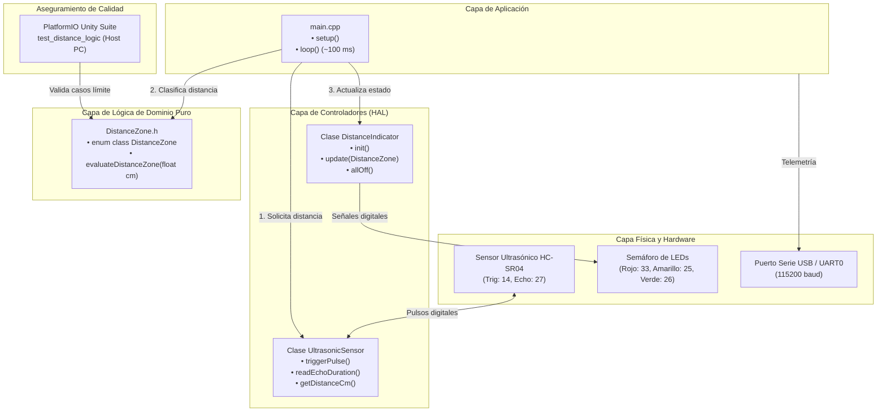
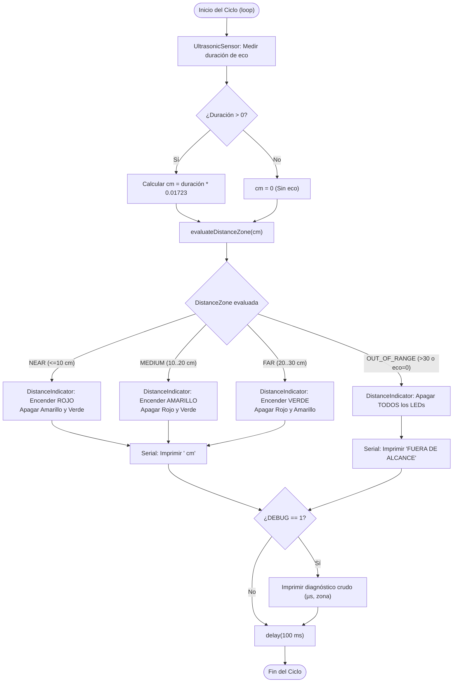

# Memoria Técnica y Documentación Integral del Sistema
## Proyecto: UltrasonicLedsSensor (Medición y Alerta Visual de Proximidad en ESP32)

---

## 1. ANÁLISIS DE REQUERIMIENTOS

### 1.1 Introducción y Propósito del Sistema
El proyecto **UltrasonicLedsSensor** es un sistema embebido interactivo de monitoreo de proximidad en tiempo real implementado sobre el microcontrolador **ESP32** bajo el entorno **PlatformIO** y el framework **Arduino**. El sistema adquiere información de distancia mediante un sensor ultrasónico **HC-SR04**, procesa la información y notifica la cercanía de obstáculos mediante un semáforo de tres LEDs (verde, amarillo y rojo), emitiendo adicionalmente telemetría y diagnósticos por puerto serie.

El propósito principal del proyecto es de carácter **académico y formativo**. Está concebido como un caso de estudio riguroso para la enseñanza y aplicación de **buenas prácticas de ingeniería de software embebido**, demostrando:
* Transición de código monolítico secuencial a **Programación Orientada a Objetos (POO)** limpia y didáctica.
* **Separación de responsabilidades y desacoplamiento de la lógica de negocio**, permitiendo la testabilidad sin dependencias del microcontrolador.
* Implementación de **telemetría estructurada y depuración de coste cero** (`zero-cost abstractions`) mediante macros de compilación.
* **Verificación formal dual**: pruebas automáticas unitarias con framework profesional (**Unity**) ejecutables en PC y protocolos de comprobación manual en laboratorio físico.

---

### 1.2 Principios Físicos de Operación
El sensado de proximidad se fundamenta en la cinemática de ondas acústicas ultrasónicas (**Time-of-Flight** o Tiempo de Vuelo):
1. **Emisión acústica:** El microcontrolador comanda al sensor HC-SR04 a emitir una ráfaga de 8 pulsos ultrasónicos a una frecuencia de **40 kHz** (inaudible para el oído humano).
2. **Propagación en el aire:** La onda viaja a través del aire a una velocidad $v \approx 343\,\text{m/s}$ (a 20°C a nivel del mar), equivalente a $0.0343\,\text{cm}/\mu\text{s}$.
3. **Reflexión y eco:** Al chocar contra un obstáculo acústicamente reflectante, la onda rebota y regresa al transductor receptor del sensor.
4. **Cálculo cinemático:** Dado que la onda recorre dos veces la distancia entre el sensor y el objeto (ida y vuelta), la distancia unidireccional $d$ en centímetros se obtiene mediante:
   $$d = \frac{t \times v}{2} = \frac{t \times 0.0343\,\text{cm}/\mu\text{s}}{2} = t \times 0.01715 \approx t \times 0.01723\,\text{cm}$$
   Donde $t$ es el tiempo en microsegundos que el pin de Eco permanece en nivel alto.

---

### 1.3 Requerimientos Funcionales (RF)

| ID | Nombre | Descripción Técnica |
|---|---|---|
| **RF-1** | **Disparo Ultrasónico** | El sistema debe excitar el pin `TRIGGER` (GPIO 14) con un pulso positivo de exactamente $10\,\mu\text{s}$ precedido por una limpieza de $2\,\mu\text{s}$ en nivel bajo. |
| **RF-2** | **Captura de Eco con Timeout** | El sistema debe medir el ancho de pulso en nivel alto del pin `ECHO` (GPIO 27) con un tiempo límite de espera acotado a $30.000\,\mu\text{s}$ ($30\,\text{ms}$, equivalente a ~5 metros de alcance). |
| **RF-3** | **Cálculo de Distancia Métrica** | El sistema debe convertir la duración del pulso a centímetros multiplicando por la constante cinemática $0.01723$. Si no hay eco (duración = 0), debe identificar la condición de fuera de rango. |
| **RF-4** | **Clasificación por Zonas** | El sistema debe clasificar el valor de distancia de manera determinista en una de cuatro zonas de proximidad discretas: <br>• **Cerca (`NEAR`):** $0 < d \le 10.0\,\text{cm}$<br>• **Medio (`MEDIUM`):** $10.0 < d \le 20.0\,\text{cm}$<br>• **Lejos (`FAR`):** $20.0 < d \le 30.0\,\text{cm}$<br>• **Fuera de Alcance (`OUT_OF_RANGE`):** $d > 30.0\,\text{cm}$ o eco nulo ($0\,\mu\text{s}$). |
| **RF-5** | **Señalización Visual Exclusiva** | El sistema debe comandar tres actuadores LED garantizando **exclusión mutua estricta**:<br>• En `NEAR`: Enciende únicamente el LED Rojo (GPIO 33).<br>• En `MEDIUM`: Enciende únicamente el LED Amarillo (GPIO 25).<br>• En `FAR`: Enciende únicamente el LED Verde (GPIO 26).<br>• En `OUT_OF_RANGE`: Apaga simultáneamente todos los LEDs. |
| **RF-6** | **Telemetría UART Estándar** | El sistema debe transmitir continuamente por UART0 a **115200 baudios** el reporte de distancia formateado (`"<valor> cm"` o `"FUERA DE ALCANCE"`). |
| **RF-7** | **Diagnóstico Condicional (Debug)** | El sistema debe soportar un canal de diagnóstico detallado que, al compilar con `#define DEBUG 1`, emita el tiempo crudo de eco en microsegundos, la zona evaluada y el estado de pines GPIO. |
| **RF-8** | **Cadencia de Muestreo** | El lazo de control debe ejecutarse con una periodicidad aproximada de $100\,\text{ms}$ (~$10\,\text{Hz}$), permitiendo disipar ecos residuales y mantener una respuesta fluida. |

---

### 1.4 Requerimientos No Funcionales (RNF)

* **RNF-1 (Latencia y Tiempo de Respuesta):** El tiempo total transcurrido desde el movimiento del obstáculo hasta la actualización del LED correspondiente debe ser inferior a $150\,\text{ms}$.
* **RNF-2 (Determinismo y Fiabilidad):** La lógica de clasificación debe ser determinista, sin estados inválidos ni desbordamientos numéricos.
* **RNF-3 (Comprensibilidad y Valor Pedagógico):** El código debe ser autoexplicativo, estructurado en clases coherentes y sin patrones crípticos ni optimizaciones prematuras.
* **RNF-4 (Seguridad Eléctrica y Compatibilidad):** Los pines del ESP32 operan a $3.3\,\text{V}$. Los LEDs deben contar con resistencias limitadoras (220 Ω a 330 Ω) para mantener la corriente por debajo de $12\,\text{mA}$ por pin. El pin Echo debe recibir niveles compatibles con $3.3\,\text{V}$.
* **RNF-5 (Testabilidad en Host):** La lógica pura de evaluación de distancias debe poder compilarse y validarse en computadoras estándar sin requerir hardware físico.

---

### 1.5 Restricciones Invariables del Hardware y Circuito
* **Pines GPIO Asignados (Inmutables):**
  * Sensor Trigger: **GPIO 14** (Salida)
  * Sensor Echo: **GPIO 27** (Entrada)
  * LED Rojo: **GPIO 33** (Salida)
  * LED Amarillo: **GPIO 25** (Salida)
  * LED Verde: **GPIO 26** (Salida)
* **Umbrales Numéricos (Inmutables):** 10.0 cm, 20.0 cm y 30.0 cm exactos.

---

## 2. DISEÑO DEL SISTEMA

### 2.1 Arquitectura General y Diagrama de Bloques
El sistema adopta una **Arquitectura en Capas Modulares** que desacopla el hardware específico del procesamiento lógico:



---

### 2.2 Diagrama de Flujo del Lazo Principal (`loop`)



---

### 2.3 Modelo de Clases (POO)

#### A. Tipo de Dominio Puro: `DistanceZone`
Permite representar simbólicamente los estados del sistema:
```cpp
enum class DistanceZone {
    NEAR,          // <= 10.0 cm (Peligro / Proximidad crítica)
    MEDIUM,        // > 10.0 cm y <= 20.0 cm (Advertencia)
    FAR,           // > 20.0 cm y <= 30.0 cm (Zona segura)
    OUT_OF_RANGE   // > 30.0 cm o timeout (Inactivo)
};

// Función pura libre de dependencias de Arduino
DistanceZone evaluateDistanceZone(float cm);
```

#### B. Clase `UltrasonicSensor`
Encapsula la física del transductor ultrasónico:
* **Atributos privados:**
  * `uint8_t _triggerPin`: Pin GPIO de disparo (14).
  * `uint8_t _echoPin`: Pin GPIO de eco (27).
  * `unsigned long _timeoutUs`: Tiempo máximo de espera ($30.000\,\mu\text{s}$).
* **Métodos públicos:**
  * `UltrasonicSensor(uint8_t triggerPin, uint8_t echoPin, unsigned long timeoutUs = 30000)`: Constructor.
  * `void begin()`: Configura `pinMode` para Trigger y Echo.
  * `unsigned long measureEchoTimeUs()`: Dispara pulso de $10\,\mu\text{s}$ y mide duración.
  * `float measureDistanceCm()`: Retorna la distancia en centímetros.

#### C. Clase `DistanceIndicator`
Encapsula la lógica de señalización visual y garantiza **exclusión mutua**:
* **Atributos privados:**
  * `uint8_t _redPin`: Pin GPIO del LED Rojo (33).
  * `uint8_t _yellowPin`: Pin GPIO del LED Amarillo (25).
  * `uint8_t _greenPin`: Pin GPIO del LED Verde (26).
* **Métodos públicos:**
  * `DistanceIndicator(uint8_t redPin, uint8_t yellowPin, uint8_t greenPin)`: Constructor.
  * `void begin()`: Configura `pinMode` como salidas y apaga todos los LEDs.
  * `void update(DistanceZone zone)`: Aplica la matriz de activación conmutando atómicamente el semáforo.
  * `void allOff()`: Apaga simultáneamente los tres actuadores.

---

### 2.4 Matriz de Estados de los Actuadores

| Condición Lógica | `DistanceZone` | LED Rojo (GPIO 33) | LED Amarillo (GPIO 25) | LED Verde (GPIO 26) | Mensaje Serial |
|---|---|:---:|:---:|:---:|---|
| $0 < d \le 10.0\,\text{cm}$ | `NEAR` | **HIGH** | LOW | LOW | `"<cm> cm"` |
| $10.0 < d \le 20.0\,\text{cm}$ | `MEDIUM` | LOW | **HIGH** | LOW | `"<cm> cm"` |
| $20.0 < d \le 30.0\,\text{cm}$ | `FAR` | LOW | LOW | **HIGH** | `"<cm> cm"` |
| $d > 30.0\,\text{cm}$ | `OUT_OF_RANGE` | LOW | LOW | LOW | `"FUERA DE ALCANCE"` |
| $d = 0$ (Sin eco / Timeout) | `OUT_OF_RANGE` | LOW | LOW | LOW | `"FUERA DE ALCANCE"` |

---

## 3. IMPLEMENTACIÓN

### 3.1 Estructura del Proyecto PlatformIO
```text
UltrasonicLedsSensor/
├── platformio.ini                      # Configuración de entornos ESP32 y Native
├── include/
│   ├── DistanceZone.h                  # Definición del enum y función pura de clasificación
│   ├── UltrasonicSensor.h              # Cabecera de la clase UltrasonicSensor
│   └── DistanceIndicator.h             # Cabecera de la clase DistanceIndicator
├── src/
│   ├── main.cpp                        # Orquestador del firmware (setup y loop)
│   ├── DistanceZone.cpp                # Implementación de evaluateDistanceZone()
│   ├── UltrasonicSensor.cpp            # Implementación de UltrasonicSensor
│   └── DistanceIndicator.cpp           # Implementación de DistanceIndicator
└── test/
    └── test_distance_logic/
        └── test_main.cpp               # Suite de pruebas unitarias Unity
```

---

### 3.2 Configuración del Entorno Dual (`platformio.ini`)
Para soportar compilación cruzada hacia la placa física y compilación nativa en PC:
```ini
; Entorno para el microcontrolador ESP32 físico
[env:esp32doit-devkit-v1]
platform = espressif32
board = esp32doit-devkit-v1
framework = arduino
monitor_speed = 115200

; Entorno nativo para pruebas unitarias instantáneas en PC sin hardware
[env:native]
platform = native
test_framework = unity
build_flags = -std=c++11
```

---

### 3.3 Esquema de Implementación de los Módulos

#### Módulo de Dominio (`DistanceZone.h` / `DistanceZone.cpp`):
```cpp
// include/DistanceZone.h
#ifndef DISTANCE_ZONE_H
#define DISTANCE_ZONE_H

enum class DistanceZone {
    NEAR,
    MEDIUM,
    FAR,
    OUT_OF_RANGE
};

DistanceZone evaluateDistanceZone(float cm);

#endif
```
```cpp
// src/DistanceZone.cpp
#include "DistanceZone.h"

DistanceZone evaluateDistanceZone(float cm) {
    if (cm <= 0.0f) {
        return DistanceZone::OUT_OF_RANGE;
    } else if (cm <= 10.0f) {
        return DistanceZone::NEAR;
    } else if (cm <= 20.0f) {
        return DistanceZone::MEDIUM;
    } else if (cm <= 30.0f) {
        return DistanceZone::FAR;
    } else {
        return DistanceZone::OUT_OF_RANGE;
    }
}
```

#### Módulo de Control de LEDs (`DistanceIndicator.h` / `DistanceIndicator.cpp`):
```cpp
// src/DistanceIndicator.cpp
#include "DistanceIndicator.h"
#include <Arduino.h>

void DistanceIndicator::update(DistanceZone zone) {
    switch (zone) {
        case DistanceZone::NEAR:
            digitalWrite(_redPin, HIGH);
            digitalWrite(_yellowPin, LOW);
            digitalWrite(_greenPin, LOW);
            break;
        case DistanceZone::MEDIUM:
            digitalWrite(_redPin, LOW);
            digitalWrite(_yellowPin, HIGH);
            digitalWrite(_greenPin, LOW);
            break;
        case DistanceZone::FAR:
            digitalWrite(_redPin, LOW);
            digitalWrite(_yellowPin, LOW);
            digitalWrite(_greenPin, HIGH);
            break;
        case DistanceZone::OUT_OF_RANGE:
        default:
            allOff();
            break;
    }
}
```

#### Gestión de Depuración en `main.cpp`:
```cpp
#define DEBUG 0  // Cambiar a 1 para trazas detalladas

#if DEBUG
  #define DEBUG_PRINT(x) Serial.print(x)
  #define DEBUG_PRINTLN(x) Serial.println(x)
#else
  #define DEBUG_PRINT(x)
  #define DEBUG_PRINTLN(x)
#endif
```

---

## 4. TESTING Y VERIFICACIÓN

### 4.1 Estrategia de Calidad
La verificación sigue una estrategia integral en dos niveles:
1. **Verificación Automatizada en Host:** Pruebas unitarias de software sobre la lógica pura mediante **Unity**, asegurando que todos los casos de borde se evalúen sin errores.
2. **Verificación Física en Laboratorio:** Protocolo de validación manual en protoboard para comprobar la fidelidad eléctrica y la respuesta de los transductores físicos.

---

### 4.2 Pruebas Unitarias Automatizadas (Unity en PlatformIO)

Ubicación: `test/test_distance_logic/test_main.cpp`
Ejecución: `pio test -e native`

#### Matriz de Casos de Prueba Automatizados:

| Test ID | Caso de Prueba | Entrada (`cm`) | Salida Esperada (`DistanceZone`) | Aserción Unity |
|---|---|:---:|:---:|---|
| **TC-01** | Sin eco / Eco nulo | `0.0f` | `DistanceZone::OUT_OF_RANGE` | `TEST_ASSERT_EQUAL(OUT_OF_RANGE, evaluate(0.0f))` |
| **TC-02** | Entrada negativa anómala | `-5.0f` | `DistanceZone::OUT_OF_RANGE` | `TEST_ASSERT_EQUAL(OUT_OF_RANGE, evaluate(-5.0f))` |
| **TC-03** | Distancia muy cercana | `3.5f` | `DistanceZone::NEAR` | `TEST_ASSERT_EQUAL(NEAR, evaluate(3.5f))` |
| **TC-04** | **Límite superior Zona Roja** | `10.0f` | `DistanceZone::NEAR` | `TEST_ASSERT_EQUAL(NEAR, evaluate(10.0f))` |
| **TC-05** | **Frontera inferior Zona Amarilla** | `10.01f` | `DistanceZone::MEDIUM` | `TEST_ASSERT_EQUAL(MEDIUM, evaluate(10.01f))` |
| **TC-06** | Punto medio Zona Amarilla | `15.0f` | `DistanceZone::MEDIUM` | `TEST_ASSERT_EQUAL(MEDIUM, evaluate(15.0f))` |
| **TC-07** | **Límite superior Zona Amarilla** | `20.0f` | `DistanceZone::MEDIUM` | `TEST_ASSERT_EQUAL(MEDIUM, evaluate(20.0f))` |
| **TC-08** | **Frontera inferior Zona Verde** | `20.01f` | `DistanceZone::FAR` | `TEST_ASSERT_EQUAL(FAR, evaluate(20.01f))` |
| **TC-09** | Punto medio Zona Verde | `25.0f` | `DistanceZone::FAR` | `TEST_ASSERT_EQUAL(FAR, evaluate(25.0f))` |
| **TC-10** | **Límite superior Zona Verde** | `30.0f` | `DistanceZone::FAR` | `TEST_ASSERT_EQUAL(FAR, evaluate(30.0f))` |
| **TC-11** | **Frontera Fuera de Rango** | `30.01f` | `DistanceZone::OUT_OF_RANGE` | `TEST_ASSERT_EQUAL(OUT_OF_RANGE, evaluate(30.01f))` |
| **TC-12** | Obstáculo muy distante | `150.0f` | `DistanceZone::OUT_OF_RANGE` | `TEST_ASSERT_EQUAL(OUT_OF_RANGE, evaluate(150.0f))` |

---

### 4.3 Protocolo de Pruebas Manuales en Hardware

#### Materiales y Banco de Pruebas:
* ESP32 DevKit v1 montado en protoboard.
* Sensor HC-SR04 conectado a 5V/3.3V, Trigger en GPIO 14, Echo en GPIO 27.
* 3 LEDs (Rojo en GPIO 33, Amarillo en GPIO 25, Verde en GPIO 26) con resistencias de $220\,\Omega$.
* Regla métrica de 50 cm fijada a la mesa y un obstáculo plano perpendicular (madera o cartón rígido).
* Monitor serie abierto a 115200 baudios.

#### Procedimiento de Verificación en Laboratorio:

```text
+-----------------------------------------------------------------------------------------+
| PASO | DISTANCIA OBSTÁCULO | RESPUESTA ESPERADA LEDS | SALIDA SERIE UART | RESULTADO    |
+-----------------------------------------------------------------------------------------+
| 1    | Obstáculo a 5 cm    | Solo LED ROJO ON        | "5.xx cm"         | [ ] APROBADO |
| 2    | Obstáculo a 10 cm   | Solo LED ROJO ON        | "10.00 cm"        | [ ] APROBADO |
| 3    | Obstáculo a 15 cm   | Solo LED AMARILLO ON    | "15.xx cm"        | [ ] APROBADO |
| 4    | Obstáculo a 20 cm   | Solo LED AMARILLO ON    | "20.00 cm"        | [ ] APROBADO |
| 5    | Obstáculo a 25 cm   | Solo LED VERDE ON       | "25.xx cm"        | [ ] APROBADO |
| 6    | Obstáculo a 30 cm   | Solo LED VERDE ON       | "30.00 cm"        | [ ] APROBADO |
| 7    | Obstáculo a 40 cm   | TODOS LOS LEDS OFF      | "FUERA DE ALCANCE"| [ ] APROBADO |
| 8    | Sensor tapado/descon| TODOS LOS LEDS OFF      | "FUERA DE ALCANCE"| [ ] APROBADO |
+-----------------------------------------------------------------------------------------+
```

---

### 4.4 Conclusión del Aseguramiento de Calidad
Este enfoque asegura que el proyecto cumple con los más altos estándares pedagógicos de ingeniería:
1. **Comprobabilidad inmediata sin hardware** para evaluación docente y desarrollo continuo.
2. **Robustez en banco de laboratorio**, garantizando cero discrepancias respecto a la especificación y preservando de manera inviolable el funcionamiento del circuito original.
