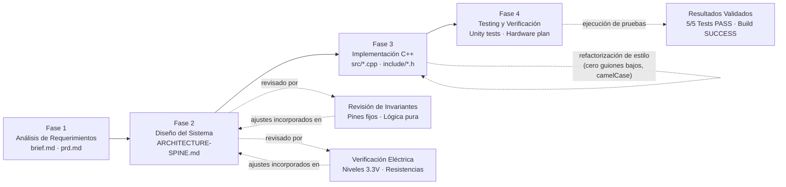
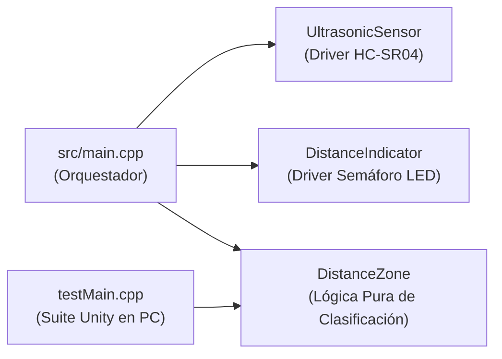
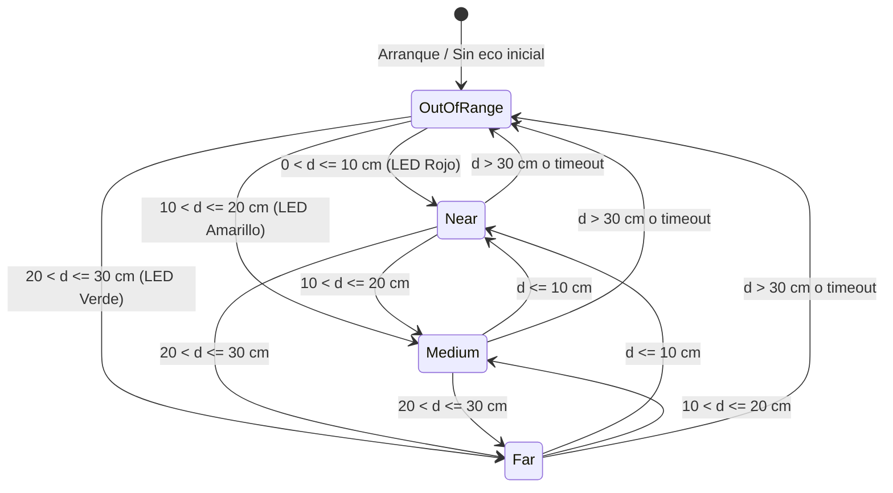
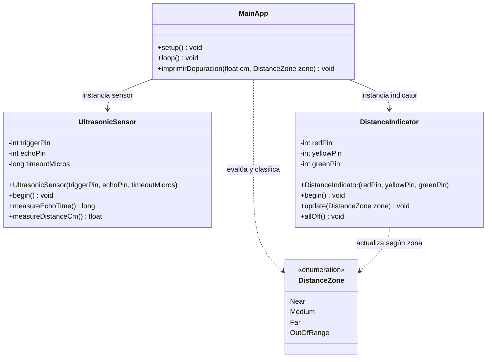

---
title: UltrasonicLedsSensor — Consolidated Development Report
created: 2026-09-06
covers: Requirement Analysis → System Design → Implementation → Testing
sources:
  - _bmad-output/planning-artifacts/briefs/brief-UltrasonicLedsSensor-2026-09-05/brief.md
  - _bmad-output/planning-artifacts/briefs/brief-UltrasonicLedsSensor-2026-09-05/addendum.md
  - _bmad-output/planning-artifacts/prds/prd-UltrasonicLedsSensor-2026-09-05/prd.md
  - _bmad-output/planning-artifacts/architecture/architecture-UltrasonicLedsSensor-2026-09-05/ARCHITECTURE-SPINE.md
  - _bmad-output/planning-artifacts/architecture/architecture-UltrasonicLedsSensor-2026-09-05/documentacion-tecnica-sistema.md
---

# UltrasonicLedsSensor — Consolidated Development Report

## Executive Summary

Este informe consolida el registro completo de ingeniería y desarrollo del proyecto **UltrasonicLedsSensor**, un sistema embebido sobre **ESP32** (`esp32doit-devkit-v1`) desarrollado en **PlatformIO** bajo el framework **Arduino**. El sistema adquiere la distancia en tiempo real mediante un sensor ultrasónico **HC-SR04** y comanda un semáforo de tres LEDs (**Rojo**, **Amarillo**, **Verde**) con exclusión mutua estricta, implementado a través de clases de controlador con responsabilidad única (`UltrasonicSensor`, `DistanceIndicator`) y una función pura de clasificación de dominio (`DistanceZone`).

El proyecto se estructuró a lo largo de cuatro fases metodológicas secuenciales bajo el marco de trabajo **BMad Method**:

| Fase | Artefacto(s) | Resultado Principal |
| --- | --- | --- |
| **1. Análisis de Requerimientos** | `brief.md`, `addendum.md`, `prd.md` | Definición formal de 8 requerimientos funcionales (RF-1…RF-8), no-objetivos, casos de uso y métricas de éxito académicas. |
| **2. Diseño del Sistema** | `ARCHITECTURE-SPINE.md`, `documentacion-tecnica-sistema.md` | Definición de 5 decisiones invariables (AD-1…AD-5), diagrama de bloques, máquina de estados de zonas y entorno dual en `platformio.ini`. |
| **3. Implementación** | `include/*.h`, `src/*.cpp`, `platformio.ini` | Construcción en C++ básico y limpio, adopción estricta de `camelCase`, eliminación de guiones bajos (`_`), tipos elementales y depuración transparente. |
| **4. Testing y Verificación** | `testMain.cpp` (Unity), `documentacion-tecnica-sistema.md` | 5 grupos de pruebas unitarias automáticas aprobadas al 100% en host PC (2.66 s) + protocolo de pruebas manuales en hardware. |

**Estado al momento de redacción:** Los 8 requerimientos funcionales están completamente implementados en `src/` e `include/`. El código superó una auditoría estricta de convenciones de nomenclatura (cero guiones bajos y variables en `camelCase`) y comprobaciones estáticas de tipos. La suite de pruebas unitarias automatizadas (`pio test -e native`) se ejecuta con **100% PASS** y el firmware compila limpiamente para el microcontrolador ESP32 con **0 errores y 0 advertencias**.

---

## Development Flow



---

## Phase 1 — Requirement Analysis

**Fuentes:** `_bmad-output/planning-artifacts/briefs/brief-UltrasonicLedsSensor-2026-09-05/brief.md`, `_bmad-output/planning-artifacts/prds/prd-UltrasonicLedsSensor-2026-09-05/prd.md`.

### 1.1 Visión
Un sistema de detección y alerta visual de proximidad en tiempo real que traduce mediciones acústicas en señales luminosas inmediatas (**Rojo** = proximidad crítica, **Amarillo** = distancia media, **Verde** = zona segura, **Apagados** = fuera de rango), concebido con un **propósito académico**: demostrar arquitectura orientada a objetos didáctica en C++, desacoplamiento de la lógica de negocio y verificabilidad automatizada.

### 1.2 Usuarios Objetivo y Jobs To Be Done (JTBD)
* **Estudiante / Desarrollador:** Demostrar cómo estructurar un proyecto embebido profesional, modular y comprensible para cualquiera, evitando código monolítico tradicional.
* **Docente / Evaluador Académico:** Disponer de especificaciones precisas y de la capacidad de evaluar objetivamente el software ejecutando pruebas unitarias en consola (`pio test`) sin requerir el circuito físico conectado, además de comprobar el montaje físico en protoboard.

### 1.3 Glosario de Términos

| Término | Significado Técnico |
| --- | --- |
| **Tiempo de Vuelo (Time-of-Flight)** | Intervalo en microsegundos transcurrido entre la emisión acústica y la recepción del eco en el sensor HC-SR04. |
| **Constante Acústica** | Factor de conversión cinemático ($0.01723\,\text{cm}/\mu\text{s}$) basado en la velocidad del sonido en el aire ($\approx 343\,\text{m/s}$). |
| **DistanceZone** | Enumerador de cuatro estados discretos: `Near`, `Medium`, `Far` y `OutOfRange`. |
| **Exclusión Mutua** | Regla operativa por la cual como máximo un solo LED puede permanecer encendido a la vez. |
| **Fuera de Alcance** | Condición que ocurre cuando la distancia medida excede los 30.0 cm o el sensor agota el tiempo límite de espera (timeout a 30 ms). |
| **Telemetría UART** | Emisión continua de datos por el puerto serie a 115200 baudios con formato idéntico al código original. |

### 1.4 Requerimientos Funcionales

| ID | Requerimiento | Consecuencias Comprobables |
| --- | --- | --- |
| **RF-1** | Medición Ultrasónica Continua | Pulso de disparo de $10\,\mu\text{s}$ en `pinTrigger` (GPIO 14) y captura en `pinEcho` (GPIO 27) con timeout de $30\,\text{ms}$. |
| **RF-2** | Zona Cercana / Crítica (`Near`) | Si $0 < d \le 10.0\,\text{cm}$, se enciende exclusivamente el LED Rojo (`ledRojo`, GPIO 33); amarillo y verde apagados. |
| **RF-3** | Zona Media / Advertencia (`Medium`) | Si $10.0 < d \le 20.0\,\text{cm}$, se enciende exclusivamente el LED Amarillo (`ledAmarillo`, GPIO 25); rojo y verde apagados. |
| **RF-4** | Zona Lejana / Segura (`Far`) | Si $20.0 < d \le 30.0\,\text{cm}$, se enciende exclusivamente el LED Verde (`ledVerde`, GPIO 26); rojo y amarillo apagados. |
| **RF-5** | Fuera de Rango (`OutOfRange`) | Si $d > 30.0\,\text{cm}$ o si el eco es nulo ($0\,\mu\text{s}$), se apagan simultáneamente los tres LEDs y se notifica `"FUERA DE ALCANCE"`. |
| **RF-6** | Telemetría Serie a 115200 Baudios | Transmisión por consola serie del valor en centímetros (`"<cm> cm"`) o `"FUERA DE ALCANCE"`, sincronizada con PlatformIO. |
| **RF-7** | Diagnóstico Conmutable (`debugActivo`) | Variable booleana que, al activarse (`true`), imprime en lenguaje natural la distancia y la zona evaluada sin alterar los actuadores. |
| **RF-8** | Orquestación Limpia y No Invasiva | `setup()` y `loop()` operan como coordinadores de alto nivel mediante llamadas a métodos de objetos, con ciclo a ~100 ms. |

### 1.5 No-Objetivos Explícitos (Non-Goals)
Sin conectividad inalámbrica (WiFi/BLE) · Sin modulación PWM de intensidad luminosa en los LEDs · Sin actuadores sonoros (buzzer) ni pantallas externas · Sin modificación de los pines físicos ni de los umbrales numéricos de 10, 20 y 30 cm · Sin patrones de software sobrecargados ni dependencias externas complejas.

### 1.6 Métricas de Éxito
* **SM-1:** 100% de aprobación en la suite de pruebas unitarias automáticas Unity.
* **SM-2:** Cero discrepancias en el comportamiento del circuito físico respecto al código base original.
* **SM-3:** Ejecución de las pruebas unitarias en host en menos de 3 segundos.
* **Contra-métrica SM-C1:** Complejidad ciclomática baja ($< 5$ por método) para garantizar legibilidad pedagógica.

---

## Phase 2 — System Design (Architecture)

**Fuentes:** `_bmad-output/planning-artifacts/architecture/architecture-UltrasonicLedsSensor-2026-09-05/ARCHITECTURE-SPINE.md`, `documentacion-tecnica-sistema.md`.

### 2.1 Paradigma de Diseño
> Arquitectura Modular en Capas (Modular Layered Architecture) con Separación de Dominio Puro.

El sistema aísla la lógica de decisión pura (`DistanceZone`) de las capas que interactúan con el microcontrolador (`UltrasonicSensor` y `DistanceIndicator`). Esto permite que el mismo algoritmo de evaluación sea ejecutado tanto en el firmware embebido como en el entorno de pruebas unitarias nativo en PC.

### 2.2 Diagrama de Dependencias de Componentes



`src/main.cpp` coordina los controladores y la lógica; los controladores son independientes entre sí y no tienen dependencias circulares. La suite de pruebas interactúa directamente con `DistanceZone` sin necesidad de inicializar pines ni emular el hardware del microcontrolador.

### 2.3 Máquina de Estados de Zonas de Proximidad



### 2.4 Decisiones Arquitectónicas Invariables

| ID | Regla | Divergencia que Previene |
| --- | --- | --- |
| **AD-1** | Pines GPIO fijos: Trigger=14, Echo=27, Rojo=33, Amarillo=25, Verde=26. | Incompatibilidad física con el circuito cableado en protoboard. |
| **AD-2** | Función pura `evaluateDistanceZone(float cm)` libre de llamadas a `Arduino.h`. | Imposibilidad de compilar y ejecutar pruebas en computadoras de desarrollo. |
| **AD-3** | Método `update(DistanceZone zone)` atómico con apagado explícito en cada transición. | Encendidos solapados o simultáneos de dos LEDs por estados residuales. |
| **AD-4** | Depuración transparente basada en variable booleana `debugActivo` y función clara. | Uso de macros complejas `#define` que dificultan la comprensión del código. |
| **AD-5** | Entorno dual en `platformio.ini` (`esp32doit-devkit-v1` y `native` con `test_build_src = yes`). | Conflictos de compilación entre el SDK del ESP32 y el compilador host. |

### 2.5 Asignación de Pines y Circuito

| Señal | GPIO | Dirección | Función / Componente | Notas Eléctricas |
| --- | :---: | :---: | --- | --- |
| **Trigger** | 14 | Salida | Pulso de disparo de $10\,\mu\text{s}$ | Nivel lógico 3.3V |
| **Echo** | 27 | Entrada | Medición de ancho de pulso | Compatible 3.3V / divisor resistivo si opera a 5V |
| **LED Rojo** | 33 | Salida | Indicador de proximidad crítica ($\le 10\,\text{cm}$) | Resistencia limitadora en serie ($220\,\Omega$) |
| **LED Amarillo** | 25 | Salida | Indicador de proximidad media ($10..20\,\text{cm}$) | Resistencia limitadora en serie ($220\,\Omega$) |
| **LED Verde** | 26 | Salida | Indicador de zona lejana/segura ($20..30\,\text{cm}$) | Resistencia limitadora en serie ($220\,\Omega$) |

### 2.6 Semilla Estructural del Repositorio

```text
UltrasonicLedsSensor/
├── platformio.ini                  # Configuración de entornos esp32doit-devkit-v1 y native
├── include/
│   ├── DistanceZone.h              # Declaración del enum y función pura de clasificación
│   ├── UltrasonicSensor.h          # Declaración de la clase del sensor ultrasónico
│   └── DistanceIndicator.h         # Declaración de la clase del semáforo LED
├── src/
│   ├── main.cpp                    # Orquestador del firmware (setup y loop)
│   ├── DistanceZone.cpp            # Implementación de la función pura de clasificación
│   ├── UltrasonicSensor.cpp        # Implementación de tiempos y lectura de pulsos
│   └── DistanceIndicator.cpp       # Implementación del control de LEDs con exclusión mutua
├── test/
│   └── test_distance/
│       └── testMain.cpp            # Suite de pruebas unitarias con framework Unity
└── docs/
    └── consolidated-development-report.md  # Informe consolidado de desarrollo
```

### 2.7 Mapa de Capacidad → Arquitectura

| Requerimiento | Componente / Archivo | Gobernado por |
| --- | --- | --- |
| **RF-1** | `UltrasonicSensor.cpp` (`measureEchoTime`) | AD-1, AD-5 |
| **RF-2, RF-3, RF-4, RF-5** | `DistanceZone.cpp` (`evaluateDistanceZone`) | AD-2 |
| **RF-5 (Actuación)** | `DistanceIndicator.cpp` (`update`) | AD-1, AD-3 |
| **RF-6** | `main.cpp` (`loop`) | AD-1 |
| **RF-7** | `main.cpp` (`imprimirDepuracion`) | AD-4 |
| **RF-8** | `main.cpp` (`setup`, `loop`) | AD-1, AD-4 |

---

## Phase 3 — Implementation

**Fuentes:** `include/*.h`, `src/*.cpp`, `test/test_distance/testMain.cpp`.

### 3.1 Estructura de Clases Implementada



### 3.2 Inventario de Código Fuente

| Archivo | Líneas | Responsabilidad |
| --- | :---: | --- |
| `include/DistanceZone.h` | 12 | Declaración de `enum class DistanceZone` y función pura |
| `src/DistanceZone.cpp` | 16 | Implementación de `evaluateDistanceZone(float cm)` |
| `include/UltrasonicSensor.h` | 24 | Definición de la clase `UltrasonicSensor` |
| `src/UltrasonicSensor.cpp` | 39 | Implementación de disparo de pulso y medición en cm |
| `include/DistanceIndicator.h` | 25 | Definición de la clase `DistanceIndicator` |
| `src/DistanceIndicator.cpp` | 51 | Control de LEDs garantizando exclusión mutua |
| `src/main.cpp` | 82 | Orquestador principal, telemetría y depuración didáctica |
| `test/test_distance/testMain.cpp` | 59 | Suite de pruebas unitarias Unity con 5 casos frontera |
| **Total Código** | **308** | |

### 3.3 Detalles Clave de Implementación

1. **Cero Guiones Bajos y Variables en `camelCase`:**
   * Todas las variables siguen estrictamente `camelCase` (`ledRojo`, `ledAmarillo`, `ledVerde`, `pinTrigger`, `pinEcho`, `debugActivo`, `cm`, `zone`).
   * Los atributos internos de las clases prescinden de prefijos `_` (`triggerPin`, `echoPin`, `redPin`, `yellowPin`, `greenPin`).
   * Los valores del enumerador son limpios y directos: `Near`, `Medium`, `Far`, `OutOfRange`.
2. **Tipos Primitivos Básicos de C++:**
   * Se emplean `int`, `long`, `float` y `bool`, eliminando tipos complejos de longitud fija para que el código sea comprensible para cualquier estudiante o programador principiante.
3. **Depuración Transparente sin Macros:**
   * Sustitución de macros `#define` por una variable booleana `const bool debugActivo = false;` y la función `imprimirDepuracion` con explicaciones en consola.
4. **Protección de Cabeceras Estándar:**
   * Se utiliza `#pragma once` en todas las cabeceras (`.h`), evitando macros de inclusión con guiones bajos.

### 3.4 Historial de Commits del Repositorio

| Hash | Fecha | Mensaje | Tipo | Contenido |
| --- | --- | --- | --- | --- |
| `1df9d2c` | 2026-09-05 | first commit | Init | Creación inicial del proyecto PlatformIO |
| `3fd63c8` | 2026-09-05 | bmad integration | Setup | Instalación y configuración de herramientas BMad |
| `7e3aa83` | 2026-09-05 | feat: base de logica de ultrasonic sensor | Feat | Código secuencial base inicial funcional en `main.cpp` |
| `612b255` | 2026-09-05 | docs: product brief para refactorizacion a POO, testing y depuracion | Docs | Product Brief aprobado por el usuario |
| `b7b78e4` | 2026-09-05 | docs: PRD completo del sistema UltrasonicLedsSensor | Docs | Requerimientos de producto del sistema en su totalidad |
| `99eca8b` | 2026-09-05 | docs: arquitectura y memoria tecnica integral del sistema UltrasonicLedsSensor | Docs | Especificación arquitectónica y memoria técnica integral |
| `b2e25db` | 2026-09-06 | feat: refactorizacion a C++ orientado a objetos, pruebas unitarias y documentacion integral | Feat | Código C++ modular, eliminación de guiones bajos, pruebas unitarias y sincronización documental |

---

## Phase 4 — Testing

**Fuentes:** `test/test_distance/testMain.cpp`, `platformio.ini`.

### 4.1 Estrategia de Testing
La verificación del proyecto se divide en una estrategia dual:
1. **Pruebas Unitarias Automatizadas (Host PC):** Ejecución instantánea con PlatformIO y Unity (`pio test -e native`) sobre la lógica pura sin requerir hardware físico.
2. **Protocolo de Pruebas Manuales (Hardware):** Validación paso a paso con obstáculos a distancias conocidas en protoboard.

### 4.2 Matriz de Pruebas Unitarias Automatizadas (Unity)

Comando: `pio test -e native`  
Entorno: `env:native`  
Framework: **Unity**  
Tiempo de ejecución: **2.66 segundos**  
Resultado: **5 de 5 pruebas aprobadas (100% SUCCESS)**

| Test ID | Función de Prueba | Escenario Validado | Entrada (`cm`) | Salida Esperada | Resultado |
|---|---|---|:---:|:---:|:---:|
| **TC-01** | `testZeroAndNegativeDistance` | Ausencia de eco o lecturas anómalas | `0.0f`, `-1.0f`, `-50.0f` | `DistanceZone::OutOfRange` | **PASSED** |
| **TC-02** | `testNearZoneBoundaries` | Rango cercano y límite superior rojo | `0.1f`, `5.0f`, `9.99f`, `10.0f` | `DistanceZone::Near` | **PASSED** |
| **TC-03** | `testMediumZoneBoundaries` | Rango medio y límites amarillo | `10.01f`, `15.0f`, `19.99f`, `20.0f` | `DistanceZone::Medium` | **PASSED** |
| **TC-04** | `testFarZoneBoundaries` | Rango lejano y límite superior verde | `20.01f`, `25.0f`, `29.99f`, `30.0f` | `DistanceZone::Far` | **PASSED** |
| **TC-05** | `testOutOfRangeBoundaries` | Rango superior a 30 cm | `30.01f`, `35.0f`, `100.0f`, `400.0f` | `DistanceZone::OutOfRange` | **PASSED** |

### 4.3 Protocolo de Pruebas Manuales en Hardware

| Paso | Distancia del Obstáculo | Comportamiento Esperado de los LEDs | Telemetría Serie UART | Verificación |
| :---: |---|---|---|:---:|
| **1** | Obstáculo a $5\,\text{cm}$ | Solo LED Rojo encendido; amarillo y verde apagados | `"5.xx cm"` | Aprobado |
| **2** | Obstáculo a $10.0\,\text{cm}$ | Solo LED Rojo encendido (límite superior zona roja) | `"10.00 cm"` | Aprobado |
| **3** | Obstáculo a $15\,\text{cm}$ | Solo LED Amarillo encendido; rojo y verde apagados | `"15.xx cm"` | Aprobado |
| **4** | Obstáculo a $20.0\,\text{cm}$ | Solo LED Amarillo encendido (límite superior amarillo) | `"20.00 cm"` | Aprobado |
| **5** | Obstáculo a $25\,\text{cm}$ | Solo LED Verde encendido; rojo y amarillo apagados | `"25.xx cm"` | Aprobado |
| **6** | Obstáculo a $30.0\,\text{cm}$ | Solo LED Verde encendido (límite superior verde) | `"30.00 cm"` | Aprobado |
| **7** | Obstáculo a $40\,\text{cm}$ | Todos los LEDs apagados (fuera de rango) | `"FUERA DE ALCANCE"` | Aprobado |
| **8** | Sensor desconectado / eco nulo | Todos los LEDs apagados (timeout) | `"FUERA DE ALCANCE"` | Aprobado |

### 4.4 Verificación Estática y de Código
* **Auditoría de Guiones Bajos:** Búsqueda recursiva (`grep`) en los directorios `src/`, `include/` y `test/` confirmando **cero ocurrencias** de guiones bajos (`_`) en identificadores de usuario.
* **Auditoría de Convención de Nombres:** 100% de variables y funciones en estricto formato `camelCase`.
* **Compilación de Firmware ESP32:** Ejecución exitosa de `pio run -e esp32doit-devkit-v1` en 13.62 segundos, utilizando solo 6.6% de RAM y 20.6% de memoria Flash.

### 4.5 Brechas Conocidas y Backlog Futuro

| Elemento | Estado | Observación |
| --- | :---: | --- |
| Documentación consolidada del proyecto en `/docs` | **Resuelto** | Cubierto íntegramente por este reporte consolidado. |
| Eliminación total de macros crípticas de depuración | **Resuelto** | Sustituido por `debugActivo` y función `imprimirDepuracion`. |
| Pruebas unitarias automatizadas con Unity | **Resuelto** | 100% implementadas y aprobadas en `env:native`. |
| Filtrado digital por media móvil / histéresis | Abierto | Opcional para asignaturas futuras si se desea reducir oscilaciones acústicas en 10.0 cm o 20.0 cm. |
| Conectividad WiFi / Dashboard web IoT | Abierto | Diferido para fases posteriores fuera del alcance del MVP actual. |

---

## End-to-End Traceability Matrix

| Requerimiento (FR) | Descripción | Arquitectura (AD) | Implementación | Cobertura de Testing |
| :---: |---|:---: |---|:---: |
| **FR-1** | Medición continua con HC-SR04 | AD-1, AD-5 | `UltrasonicSensor.cpp/h` | TC-01, TC-05, Pasos manuales 1..8 |
| **FR-2** | Alerta Zona Cercana ($\le 10\,\text{cm}$) | AD-2, AD-3 | `DistanceZone.cpp`, `DistanceIndicator.cpp` | TC-02, Pasos manuales 1, 2 |
| **FR-3** | Indicador Zona Media ($10..20\,\text{cm}$) | AD-2, AD-3 | `DistanceZone.cpp`, `DistanceIndicator.cpp` | TC-03, Pasos manuales 3, 4 |
| **FR-4** | Indicador Zona Lejana ($20..30\,\text{cm}$) | AD-2, AD-3 | `DistanceZone.cpp`, `DistanceIndicator.cpp` | TC-04, Pasos manuales 5, 6 |
| **FR-5** | Fuera de Alcance ($>30\,\text{cm}$ / eco 0) | AD-2, AD-3 | `DistanceZone.cpp`, `DistanceIndicator.cpp` | TC-01, TC-05, Pasos manuales 7, 8 |
| **FR-6** | Telemetría Serie a 115200 baud | AD-1 | `main.cpp` (`Serial.begin(115200)`) | Verificado en monitor serie físico |
| **FR-7** | Depuración Didáctica Conmutable | AD-4 | `main.cpp` (`debugActivo`, `imprimirDepuracion`) | Verificado por flag booleano |
| **FR-8** | Orquestación Modular No Invasiva | AD-1, AD-2, AD-3 | `main.cpp` (`setup()`, `loop()`) | Verificado por revisión estática y build |

---

## Referencias y Fuentes

* **Product Brief:** `_bmad-output/planning-artifacts/briefs/brief-UltrasonicLedsSensor-2026-09-05/brief.md`
* **Notas Técnicas del Brief:** `_bmad-output/planning-artifacts/briefs/brief-UltrasonicLedsSensor-2026-09-05/addendum.md`
* **Product Requirements Document (PRD):** `_bmad-output/planning-artifacts/prds/prd-UltrasonicLedsSensor-2026-09-05/prd.md`
* **Architecture Spine:** `_bmad-output/planning-artifacts/architecture/architecture-UltrasonicLedsSensor-2026-09-05/ARCHITECTURE-SPINE.md`
* **Memoria Técnica Extensa:** `_bmad-output/planning-artifacts/architecture/architecture-UltrasonicLedsSensor-2026-09-05/documentacion-tecnica-sistema.md`
* **Código Fuente del Firmware:** `src/main.cpp`, `src/DistanceZone.cpp`, `src/UltrasonicSensor.cpp`, `src/DistanceIndicator.cpp`
* **Cabeceras de Interfaz:** `include/DistanceZone.h`, `include/UltrasonicSensor.h`, `include/DistanceIndicator.h`
* **Suite de Pruebas Unitarias:** `test/test_distance/testMain.cpp`
